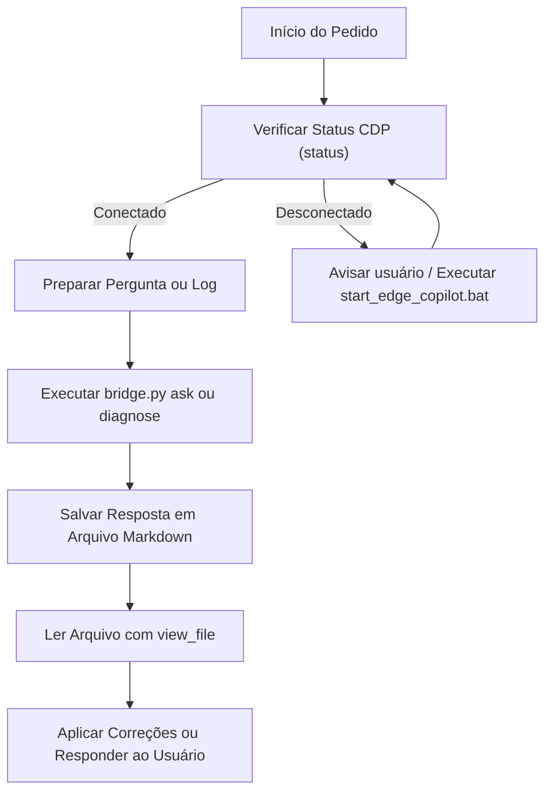

# GPT-Sol Copilot Bridge (`gpt-sol-bridge`)

## Visão Geral

Esta skill permite que o agente interaja de forma autônoma e programática com o agente corporativo **GPT-Sol** hospedado no **Microsoft 365 Copilot**, executando na sessão autenticada do usuário no **Microsoft Edge** através do protocolo CDP (*Chrome DevTools Protocol* na porta `9222`).

Com essa ponte, você pode:
1. **Consultar o GPT-Sol**: Enviar perguntas arquiteturais, dúvidas de implementação e regras técnicas corporativas.
2. **Diagnosticar Falhas de Build & Logs**: Enviar automaticamente arquivos de logs, stack traces ou erros de CI (ex: Gradle, Python, TypeScript) para obter causa raiz e correções prontas.
3. **Validar Patches de Código**: Submeter trechos de código e diffs para validação especializada antes de comitar.

---

## Pré-requisitos & Inicialização do Edge

Para que a ponte funcione, o Microsoft Edge deve estar aberto com a porta de depuração remota habilitada (`9222`) e com a sessão corporativa do Copilot ativa.

### 1. Inicialização Rápida

Execute o script de inicialização incluído na skill:
```powershell
& "scripts/start_edge_copilot.bat"
```
Ou inicie manualmente via terminal:
```powershell
Start-Process "msedge.exe" -ArgumentList "--remote-debugging-port=9222", "--remote-allow-origins=*", "https://m365.cloud.microsoft/chat"
```

### 2. Validar Conexão

Sempre verifique se a conexão CDP e a aba do Copilot estão ativas antes de enviar prompts longos:
```powershell
python .agents/skills/gpt-sol-bridge/scripts/bridge.py status
```

---

## Quick Start (Comandos Rápidos)

### 1. Fazer uma Pergunta Direta ao GPT-Sol
```powershell
python .agents/skills/gpt-sol-bridge/scripts/bridge.py ask -p "Qual a melhor estratégia para resolver dependências transitivas no Gradle?" -o "resposta_gpt_sol.md"
```

### 2. Enviar um Prompt a partir de um Arquivo
```powershell
python .agents/skills/gpt-sol-bridge/scripts/bridge.py ask -f "caminho/para/meu_prompt.txt" -o "resultado.md"
```

### 3. Diagnosticar Log de Erro ou Stack Trace
```powershell
python .agents/skills/gpt-sol-bridge/scripts/bridge.py diagnose -l "build_error.log" -c "Projeto Capacitor Android compilando para SDK 35" -o "diagnostico.md"
```

---

## Referência do Script CLI (`bridge.py`)

Localização do utilitário:  
`.agents/skills/gpt-sol-bridge/scripts/bridge.py` ou globalmente em `~/.gemini/config/skills/gpt-sol-bridge/scripts/bridge.py`

### Subcomandos Disponíveis

| Subcomando | Parâmetros Principais | Descrição |
| :--- | :--- | :--- |
| `status` | `--cdp-url` (padrão: `http://127.0.0.1:9222`) | Testa a conexão CDP com o Edge e lista as abas abertas. |
| `ask` | `-p, --prompt` (string) ou `-f, --file` (arquivo)<br>`-o, --output` (caminho Markdown)<br>`--timeout` (segundos, padrão: 120) | Envia pergunta ao Copilot, aguarda streaming completo e salva a resposta em Markdown. |
| `diagnose` | `-l, --log-file` (obrigatório)<br>`-c, --context` (opcional)<br>`-o, --output` (padrão: `diagnostico_gpt_sol.md`) | Formata automaticamente o log com prompt de engenharia reversa para identificar causa raiz e soluções. |

---

## Fluxo de Trabalho Típico (Workflow)


