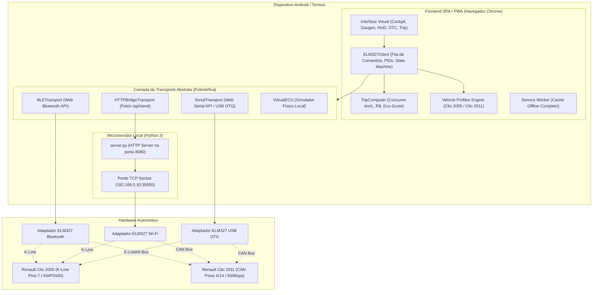

# 🚗 AutoPulse OBD2 (Infocar Style) & Projeto Renault Clio (2005 & 2011)

> **Plataforma Open-Source de Telemetria, Diagnóstico ECU e Computador de Bordo Otimizada para Renault Clio II (2005 / K-Line) e Renault Clio (2011 / CAN Bus).**  
> Desenvolvido em arquitetura **PWA (Progressive Web App)** de alta performance, executável diretamente via navegador no Android (Termux) e instalável na tela inicial.

> [!WARNING]
> **Status real do projeto: protótipo ainda NÃO validado em carro.** Tudo foi exercitado apenas contra o simulador.
> Pontos que as seções abaixo apresentam como definitivos mas que **estão por confirmar em campo**:
> - **Protocolo do Clio 2011 (CAN) e do Clio 2005 (K-Line):** não confirmado. Pode ser K-Line nos dois. Por isso o perfil padrão é a *detecção automática* e os perfis Clio estão marcados "(a validar)".
> - **Endereço `0x11` (Renault) × `0x33` (EOBD):** para PIDs genéricos o correto é o header padrão EOBD (`81 33 F1`, o padrão do ELM327). O `0x11` serve só para diagnóstico proprietário e foi removido dos perfis.
> - **Benchmark do GitHub (seção 2):** baseado em buscas e resumos, não em leitura do código dos projetos.
> - **Fases marcadas "Concluídas ✅":** significa "funciona no simulador", não "validado no carro".
> - **Adaptador Bluetooth Classic ("ELM327 azul") não conecta** neste app web (Web Bluetooth só fala BLE). Ver plano de melhoria.
>
> 📖 **Documentação de Engenharia e Próximos Passos:**
> - [Plano de Melhoria Completo (24 achados, metas e roadmap)](docs/PLANO_DE_MELHORIA.md)
> - [Roteiro de Descoberta Prático para o Adaptador Azul](docs/ROTEIRO_DESCOBERTA.md)
> - [Estado Atual e Próximos Passos](docs/ESTADO_E_PROXIMOS_PASSOS.md)

---

## 📑 Sumário

1. [Visão Geral & Contexto do Projeto](#1-visão-geral--contexto-do-projeto)
2. [Benchmark & Análise Comparativa de Projetos Open-Source (GitHub)](#2-benchmark--análise-comparativa-de-projetos-open-source-github)
3. [Dossiê Técnico: Renault Clio 2005 (K-Line) vs Renault Clio 2011 (CAN Bus)](#3-dossiê-técnico-renault-clio-2005-k-line-vs-renault-clio-2011-can-bus)
4. [Arquitetura do Sistema](#4-arquitetura-do-sistema)
5. [Architecture Decision Records (ADRs)](#5-architecture-decision-records-adrs)
   - [ADR-001: PWA Web-First + Local Termux Python Bridge](#adr-001-pwa-web-first--local-termux-python-bridge)
   - [ADR-002: Motor de Perfis de Protocolo Dinâmico (Clio 2005 K-Line vs Clio 2011 CAN)](#adr-002-motor-de-perfis-de-protocolo-dinâmico-clio-2005-k-line-vs-clio-2011-can)
   - [ADR-003: Compatibilidade de Hardware ELM327 & Mitigação de Clones](#adr-003-compatibilidade-de-hardware-elm327--mitigação-de-clones)
   - [ADR-004: Diagnóstico DTC com Dicionário Offline em Português](#adr-004-diagnóstico-dtc-com-dicionário-offline-em-português)
   - [ADR-005: Fila Assíncrona, Polling Prioritário & Watchdog K-Line](#adr-005-fila-assíncrona-polling-prioritário--watchdog-k-line)
   - [ADR-006: Telemetria Flex-Fuel (Gasolina/Etanol) & Consumo Brasileiro](#adr-006-telemetria-flex-fuel-gasolinaetanol--consumo-brasileiro)
   - [ADR-007: Head-Up Display (HUD) Noturno com Inversão Óptica](#adr-007-head-up-display-hud-noturno-com-inversão-óptica)
6. [Plano de Implementação Faseado (Roadmap)](#6-plano-de-implementação-faseado-roadmap)
7. [Guia de Operação e Diagnóstico Prático](#7-guia-de-operação-e-diagnóstico-prático)
8. [Estrutura do Repositório](#8-estrutura-do-repositório)

---

## 1. Visão Geral & Contexto do Projeto

Muitos entusiastas e proprietários de veículos da linha **Renault Clio** enfrentam grandes frustrações ao tentar conectar adaptadores universais **ELM327** com aplicativos genéricos da Play Store (como versões gratuitas do Torque, Car Scanner ou OBD Fusion). Os sintomas mais comuns são:
- Mensagens persistentes de `BUS INIT: ERROR` ou `UNABLE TO CONNECT` no **Clio 2005**;
- Travamento da comunicação após 5 a 10 segundos de leitura;
- Falha na leitura de sensores essenciais (como temperatura da água ou sonda de oxigênio);
- Leituras errôneas de consumo de combustível em motores **Hi-Flex** brasileiros (Etanol vs Gasolina).

O **AutoPulse OBD2** foi projetado para eliminar esses gargalos, combinando:
1. **Perfis de Conexão Nativos Renault:** Comandos AT específicos de temporização, endereçamento físico de ECU e controle de cabeçalho para o **Clio 2005** (K-Line / KWP2000) e **Clio 2011** (CAN 11-bit / 500kbps);
2. **Ambiente Local e Portátil no Termux:** Executa um microservidor Python sem dependências externas, funcionando como servidor HTTP de arquivos estáticos e como ponte de rede TCP para adaptadores OBD2 Wi-Fi;
3. **Frontend PWA Moderno:** Painel com visual esportivo inspirado no Infocar, com mostradores circulares SVG fluidos, modo HUD de alta visibilidade com espelhamento para para-brisa, computador de bordo com pontuação Eco-Driving e scanner DTC em português.

---

## 2. Benchmark & Análise Comparativa de Projetos Open-Source (GitHub)

Para fundamentar as decisões de engenharia, foram inspecionados os principais repositórios open-source voltados a OBD-II e ao ecossistema Renault:

| Projeto GitHub | Tecnologias | Pontos Fortes | Limitações Identificadas | Lições / Aplicação no AutoPulse |
| :--- | :--- | :--- | :--- | :--- |
| **[cedricp/ddt4all](https://github.com/cedricp/ddt4all)** | Python, PyQt, ELM327 | Acesso total a parâmetros de fábrica Renault (UCH, Airbag, Injeção) via base DDT2000. | Interface desktop pesada, complexa e com risco de corromper módulos (*expert mode*). | Mapeamento exato de endereçamento de ECU Renault (`ATSH8111F1` na K-Line e `ATSH7E0` na CAN). |
| **[PyRen](https://gitlab.com/pyren/pyren)** | Python, ELM327 | Reimplementação leve do software de concessionária Renault Clip; excelente suporte a K-Line. | Linha de comando pura ou scripts difíceis de operar ao volante no celular. | Sequência de handshake do protocolo KWP2000 Fast Init e comando `ATWM` para keep-alive. |
| **[EcuTweaker](https://github.com/cedricp/EcuTweaker)** | Python, Kivy (Android) | Port do DDT4All para telas de toque Android via Bluetooth. | Interface pouco ergonômica para monitoramento dinâmico em viagem (foco em configuração estática). | Tratamento de perda de conexão Bluetooth e seleção manual de portas serial/rfcomm. |
| **[brendan-w/python-OBD](https://github.com/brendan-w/python-OBD)** | Python | Arquitetura robusta de polling assíncrono, decodificadores de PIDs e fila não bloqueante. | Não possui interface gráfica e depende de backend nativo completo. | Estrutura de fila de comandos, tratamento de timeouts e tabela de conversão de grandezas físicas. |
| **[rpwalsh/onboarddiagnosticstool](https://github.com/rpwalsh/onboarddiagnosticstool)** | TypeScript, React, Web Bluetooth | Comunicação direta do navegador com adaptadores BLE sem instalação nativa. | Suporta apenas BLE padrão e não prevê adaptadores Wi-Fi ou USB Serial em navegadores móveis. | Padrão assíncrono de leitura de stream de caracteres e detecção do prompt `>` do ELM327. |
| **Car Scanner ELM OBD2 (Perfis Proprietários)** | Mobile App | Perfis dedicados por montadora com strings AT testadas em campo. | Código fechado; recursos avançados restritos a planos pagos. | Validação dos parâmetros ideais para ECUs Renault Siemens Sirius e Magneti Marelli IAW. |

---

## 3. Dossiê Técnico: Renault Clio 2005 (K-Line) vs Renault Clio 2011 (CAN Bus)

A frota brasileira e sul-americana do Renault Clio passou por uma transição eletroeletrônica crítica entre 2005 e 2011:

### 3.1. Renault Clio 2005 (Clio II Fase 2)
* **Regulamentação:** Pré-OBDBr-2 (o padrão obrigatório de diagnose no Brasil só entrou em vigor pleno em 2010). Muitos veículos seguiam padrões proprietários franceses.
* **Topologia de Diagnóstico:** **K-Line Física (Pino 7 do conector OBD-II DLC)**. Não há barramento CAN conectado à tomada de diagnose para injeção.
* **Motores e Centrais (ECUs) Típicas:**
  - **1.0 16V Hi-Flex (D4D):** Magneti Marelli IAW 5NR / 5NP ou Siemens SIM32.
  - **1.0 8V Gasolina (D7D):** Siemens Sirius 32.
  - **1.6 16V Hi-Flex (K4M):** Siemens Sirius 34 / EMS 3134.
* **Protocolo de Comunicação:** **ISO 14230-4 KWP (Keyword Protocol 2000)** em modo Fast Init (5 bauds como fallback).
* **Por que os apps comuns falham no Clio 2005:**
  1. **Varredura Automática (`ATSP0`):** O adaptador tenta CAN 500k, CAN 250k e outros antes da K-Line, esgotando a janela de sincronismo da ECU.
  2. **Endereçamento Genérico:** Scanners universais usam broadcast `7DF` ou `C0 33 F1`. A ECU Renault geralmente só responde ao seu endereço físico: **`11`** (Injeção) via cabeçalho `81 11 F1` (`ATSH8111F1`).
  3. **Queda de Sessão KWP (Timeout P3 Max):** Se a central ficar sem receber mensagens por mais de ~5 segundos, ela cancela a sessão de diagnóstico. É obrigatório manter tráfego contínuo ou enviar `3E 00` (*TesterPresent*).
  4. **Adaptadores ELM327 Clones ("v2.1" falsificados):** Chips piratas sem o microcontrolador **PIC18F25K80** não geram o pulso de despertar de 25ms low / 25ms high com precisão de microsegundos, causando `BUS INIT: ERROR`.

### 3.2. Renault Clio 2011 (Clio II Campus / Fase 3)
* **Regulamentação:** Em conformidade com a resolução do CONAMA / **OBDBr-2**.
* **Topologia de Diagnóstico:** **CAN Bus de Alta Velocidade (Pinos 6 CAN-H e 14 CAN-L)** a 500 kbps com identificadores de 11 bits.
* **Motores e Centrais (ECUs) Típicas:**
  - **1.0 16V Hi-Flex (D4D 760):** Siemens/Continental SIM32 ou Valeo V42.
  - **1.6 16V Hi-Flex (K4M):** Continental EMS3134 / EMS3132.
* **Protocolo de Comunicação:** **ISO 15765-4 CAN (11-bit ID, 500 kbaud)** (`ATSP6`).
* **Comportamento & Otimizações:**
  - Respostas quase instantâneas (< 15ms por comando);
  - Endereço da ECU do motor: Header de envio **`7E0`** (`ATSH7E0`), resposta em **`7E8`**;
  - Desativação de cabeçalhos (`ATH0`) para fluxo limpo de dados;
  - Temporização adaptativa (`ATAT1`) e timeout reduzido (`ATST32`) para atingir 15 a 25 atualizações de gauge por segundo;
  - Suporte ao PID `0152` para monitoramento da proporção calculada de Etanol no combustível.

### 3.3. Comparativo da Pinagem do Conector OBD-II (DLC)

```
        _________________________________
       /  1   2   3   4   5   6   7   8  \
      /                                   \
     /    9  10  11  12  13  14  15  16    \
    /_______________________________________\
```

| Pino | Função Padrão | Renault Clio 2005 | Renault Clio 2011 |
| :---: | :--- | :--- | :--- |
| **4** | Terra do Chassi (*Chassis Ground*) | Conectado (Terra) | Conectado (Terra) |
| **5** | Terra do Sinal (*Signal Ground*) | Conectado (Terra) | Conectado (Terra) |
| **6** | CAN High (ISO 15765-4) | Geralmente Ausente ou Inativo na Injeção | **Ativo (CAN-H 500k)** |
| **7** | **K-Line (ISO 9141-2 / ISO 14230-4)** | **Ativo Primário (Injeção Eletrônica)** | Ativo para módulos legados / Secundário |
| **14** | CAN Low (ISO 15765-4) | Geralmente Ausente ou Inativo na Injeção | **Ativo (CAN-L 500k)** |
| **15** | L-Line (ISO 9141-2) | Opcional (raramente usado) | Não conectado |
| **16** | Tensão Positiva da Bateria (+12V permanente) | Conectado (+12V constante) | Conectado (+12V constante) |

---

## 4. Arquitetura do Sistema



---

## 5. Architecture Decision Records (ADRs)

### ADR-001: PWA Web-First + Local Termux Python Bridge
* **Status:** Aceito e Implementado.
* **Contexto:** Compilar um aplicativo nativo Android (Java/Kotlin/Flutter) no Termux possui alto custo computacional, requer SDKs extensos e dificulta atualizações rápidas.
* **Decisão:** Construir a aplicação como um **Progressive Web App (PWA)** baseado em HTML5/CSS3/JavaScript ES Modules, servido localmente por um script Python 3 padrão (`server.py`) na porta 8080.
* **Consequências:**
  - Zero dependências de compilação ou gerenciadores externos de pacotes;
  - Instalação imediata na tela inicial do Android via Chrome como app independente em tela cheia;
  - Operação 100% offline garantida pelo `sw.js` (Service Worker).

---

### ADR-002: Motor de Perfis de Protocolo Dinâmico (Clio 2005 K-Line vs Clio 2011 CAN)
* **Status:** Aceito e Implementado.
* **Contexto:** Tentar conectar o Clio 2005 e o Clio 2011 com o comando padrão `ATSP0` (Auto) gera timeouts, perda de sincronismo e falhas de comunicação.
* **Decisão:** Criar um catálogo estático `VEHICLE_PROFILES` no módulo `elm327.js`, configurando automaticamente os comandos exatos de inicialização:
  1. **`clio2011_can`:**
     - Comandos: `ATZ`, `ATE0`, `ATL0`, `ATS1`, `ATH0`, `ATSP6`, `ATSH7E0`, `ATCAF1`, `ATAT1`, `ATST32`.
     - Foco: Alta taxa de quadros (15-20 Hz) para velocímetro e conta-giros sem travamentos.
  2. **`clio2005_fast`:**
     - Comandos: `ATZ`, `ATE0`, `ATL0`, `ATS1`, `ATH1`, `ATSP5`, `ATSH8111F1`, `ATWM8111F13E`, `ATSW00`, `ATST64`.
     - Foco: Inicialização direta KWP Fast Init na K-Line com endereço físico da injeção Renault (0x11).
  3. **`clio2005_slow`:**
     - Comandos: `ATZ`, `ATE0`, `ATL0`, `ATS1`, `ATH1`, `ATSP4`, `ATSH8111F1`, `ATIIA11`, `ATST96`.
     - Foco: Fallback para ECUs antigas Siemens Sirius 32 que exigem despertar em 5 bauds.
* **Consequências:** Elimina a incerteza do handshake e conecta em menos de 2 segundos.

---

### ADR-003: Compatibilidade de Hardware ELM327 & Mitigação de Clones
* **Status:** Aceito.
* **Contexto:** O mercado está saturado de adaptadores azuis "ELM327 v2.1" com microcontroladores de baixo custo que não implementam os protocolos ISO legados (ISO 9141 e ISO 14230) e travam com comandos `ATSH` ou `ATWM`.
* **Decisão:**
  - Implementar verificação de versão via `ATI` e comandos de tolerância a falhas;
  - Exigir nos guias de documentação o uso de adaptadores baseados no chip genuíno **Microchip PIC18F25K80** (versões firmware v1.4 ou v1.5) ou modelos de alta confiabilidade (como Vgate iCar Pro, vLinker FS ou Viecar) para o Clio 2005;
  - No Clio 2011, como a comunicação é CAN padrão, a tolerância a adaptadores comuns é significativamente maior.
* **Consequências:** Usuários economizam tempo evitando diagnósticos frustrados causados por limitações físicas de hardware pirata.

---

### ADR-004: Diagnóstico DTC com Dicionário Offline em Português
* **Status:** Aceito e Implementado.
* **Contexto:** A resposta bruta dos modos 03 e 07 é uma sequência de bytes hexadecimais (ex: `43 01 03 00 00 00`). Sem conexão com a internet na estrada, o usuário não consegue saber a gravidade da falha.
* **Decisão:**
  - Implementar decodificador completo de DTC (P0/P1/P2/P3, B0/B1/B2/B3, C0/C1/C2/C3, U0/U1/U2/U3);
  - Embarcar banco de dados offline [`dtc-db.js`](file:///data/data/com.termux/files/home/infocar-obd2/js/obd/dtc-db.js) com tradução em português, nível de severidade (Baixa, Média, Alta, Crítica) e causas comuns focadas em veículos Renault (ex: bobinas de ignição, sensor de rotação CKP, corpo de borboleta sujo, sonda lambda).
* **Consequências:** Diagnóstico instantâneo e seguro sem consumir dados móveis.

---

### ADR-005: Fila Assíncrona, Polling Prioritário & Watchdog K-Line
* **Status:** Aceito e Implementado.
* **Contexto:** O barramento K-Line do Clio 2005 tem taxa de transmissão baixa (10.400 bps), suportando no máximo 4 a 6 solicitações por segundo. Além disso, se ficar ocioso por mais de 5 segundos, a central encerra o modo de diagnose.
* **Decisão:**
  - Implementar uma fila `commandQueue` com promessas (`Promise`) e guardas de timeout dinâmicos;
  - Criar watchdog de *Keep-Alive* (`startKeepAlive`) disparando `3E 00` (*TesterPresent*) a cada 2,5 segundos quando a fila estiver ociosa em conexões K-Line;
  - Agrupar polling contínuo priorizando variáveis dinâmicas (RPM `010C` e Velocidade `010D`) e intercalando sensores lentos (Temperatura `0105`, Carga `0104`, Bateria `ATRV`).
* **Consequências:** Comunicação estável sem saturação do barramento e sem desconexões repentinas da ECU.

---

### ADR-006: Telemetria Flex-Fuel (Gasolina/Etanol) & Consumo Brasileiro
* **Status:** Aceito e Implementado.
* **Contexto:** O Brasil possui veículos com motores bi-combustível (Hi-Flex). A estequiometria varia de 14.7:1 (Gasolina com 27% etanol anidro) a 9.0:1 (Etanol hidratado puro). Cálculos universais baseados em gasolina geram erros de até 40% no consumo em km/L quando o carro está abastecido com Etanol.
* **Decisão:**
  - Suportar configuração manual de tipo de combustível (Gasolina / Etanol) e preço do litro em R$;
  - Consultar automaticamente o PID `0152` (Teor de Etanol inferido pela ECU) quando suportado pelo veículo (Clio 2011 Hi-Flex);
  - Aplicar as fórmulas baseadas no fluxo de ar MAF (g/s):
    $$\text{Taxa de Combustível (L/s)} = \frac{\text{MAF (g/s)}}{\text{AFR} \times \rho_{\text{combustível}}}$$
    $$\text{Consumo Instantâneo (km/L)} = \frac{\text{Velocidade (km/h)}}{3600 \times \text{Taxa de Combustível (L/s)}}$$
* **Consequências:** Cálculos de consumo precisos e estimativa real do custo em Reais (R$) por quilômetro rodado.

---

### ADR-007: Head-Up Display (HUD) Noturno com Inversão Óptica
* **Status:** Aceito e Implementado.
* **Contexto:** Conduzir observando a tela do smartphone no suporte gera distração. A projeção de dados no para-brisa melhora a segurança e ergonomia em viagens noturnas.
* **Decisão:**
  - Implementar modo HUD de alto contraste com fundo preto puro (`#000000`) e tipografia monoespaçada neon;
  - Adicionar chave de inversão óptica (`transform: scaleX(-1)`) via CSS, fazendo com que o reflexo no vidro dianteiro seja legível pelo motorista na orientação correta.
* **Consequências:** Projeção HUD nativa sem necessidade de película especial para para-brisa em ambientes escuros.

---

## 6. Plano de Implementação Faseado (Roadmap)

### 📌 Fase 1: Fundação de Hardware & Handshake Específico (Concluída ✅)
- [x] Criação do microservidor Python `server.py` no Termux.
- [x] Implementação da camada de transporte abstrata: Web Bluetooth (BLE), Web Serial (USB) e Ponte TCP (Wi-Fi).
- [x] Estruturação da biblioteca de PIDs OBD-II (`pids.js`).
- [x] Implementação dos perfis `clio2011_can`, `clio2005_fast` e `clio2005_slow`.
- [x] Adição do seletor visual de perfis na tela de configurações.

### 📌 Fase 2: Telemetria & Monitoramento em Tempo Real (Concluída ✅)
- [x] Mostradores circulares com animação suave via SVG (`dasharray` / `dashoffset`).
- [x] Conta-giros com aviso de faixa de corte (*redline*).
- [x] Monitor de temperatura de arrefecimento com alerta visual em >100°C.
- [x] Leitura de tensão de bateria via comando nativo `ATRV` com diagnóstico de alternador.
- [x] Watchdog de *Keep-Alive* K-Line para o Clio 2005.

### 📌 Fase 3: Diagnóstico DTC & Limpeza de Falhas (Concluída ✅)
- [x] Varredura de códigos Modo 03 (confirmados) e Modo 07 (pendentes).
- [x] Banco de dados offline de DTCs em português com causas prováveis.
- [x] Procedimento seguro de limpeza de erros (Modo 04 / Reset da luz de injeção).
- [x] Gerador de falhas simuladas para testes de bancada.

### 📌 Fase 4: Computador de Bordo & Otimização Hi-Flex (Concluída ✅)
- [x] Integração do módulo `trip.js` com cálculo de consumo em km/L e L/h.
- [x] Suporte a parâmetros estequiométricos de Etanol e Gasolina.
- [x] Algoritmo de Eco-Driving com detecção de acelerações bruscas.
- [x] Estimativa de gasto financeiro da viagem em Reais (R$).

### 📌 Fase 5: Expansões Futuras & Módulos Avançados (Próximos Passos 🚀)
- [ ] **Módulo UCH Renault (K-Line / CAN):** Adicionar leitura do estado de portas, luzes e comandos de chave através dos identificadores de conforto da Renault.
- [ ] **Data Logging CSV:** Exportação de telemetria completa da viagem para arquivo `.csv` no armazenamento do celular para análise de desempenho e telemetria mecânica.
- [ ] **Teste de Aceleração 0-100 km/h:** Módulo com cronômetro automático disparado pela variação de velocidade no barramento CAN.

---

## 7. Guia de Operação e Diagnóstico Prático

### 7.1. Onde fica a tomada OBD-II no Renault Clio?
Nos modelos **Clio II (tanto 2005 quanto 2011)**, a tomada diagnóstica de 16 pinos está localizada **no console central, logo abaixo do cinzeiro/porta-moedas**, à frente da alavanca de câmbio.  
Para acessar:
1. Puxe a tampa plástica ou remova o cinzeiro removível;
2. O conector fêmea amarelo ou preto estará voltado para cima ou levemente inclinado.

---

### 7.2. Passo a Passo de Execução no Termux

1. **Abra o aplicativo Termux no celular:**
   ```bash
   cd ~/infocar-obd2
   python server.py
   ```
2. **Acesse no navegador Google Chrome do Android:**
   ```
   http://localhost:8080
   ```
3. **Instale como PWA:**
   - No Chrome, toque nos **três pontinhos verticais** (canto superior direito);
   - Selecione **"Adicionar à tela inicial"** ou **"Instalar aplicativo"**;
   - O ícone do **AutoPulse OBD2** ficará disponível na gaveta de aplicativos.

---

### 7.3. Conectando no Renault Clio 2011 (CAN Bus)
1. Conecte o adaptador ELM327 na tomada do carro;
2. Ligue a ignição (gire a chave até acender as luzes do painel ou dê partida no motor);
3. No aplicativo, abra a aba **Ajustes**;
4. No campo **Perfil do Veículo**, selecione:
   `🚗 Renault Clio 2011 (CAN 11-bit / 500k - ATSP6)`
5. No campo **Método de Conexão**, selecione seu adaptador (Bluetooth BLE, Wi-Fi ou Cabo USB OTG);
6. Toque em **Conectar**. O painel começará a responder instantaneamente.

---

### 7.4. Conectando no Renault Clio 2005 (K-Line)
1. Certifique-se de que seu adaptador ELM327 é equipado com o chip **PIC18F25K80** (versão v1.4 ou v1.5);
2. Conecte o adaptador na tomada do Clio 2005;
3. Ligue a ignição do carro;
4. No aplicativo, abra a aba **Ajustes**;
5. No campo **Perfil do Veículo**, selecione:
   `🚗 Renault Clio 2005 (K-Line KWP2000 Fast Init - ATSP5)`
6. Toque em **Conectar**. O aplicativo executará o endereçamento físico `ATSH8111F1` e ativará o watchdog de keep-alive.
7. *Nota de Fallback:* Se o veículo tiver ECU Siemens Sirius 32 e não responder no modo Fast, troque o perfil para:
   `🚗 Renault Clio 2005 (K-Line ISO 9141 / 5-Baud - ATSP4/3)` e reconecte.

---

### 7.5. Diagnóstico Rápido no Terminal Interativo
Na aba **Terminal**, você pode enviar comandos diretos para inspecionar a resposta da central:

| Comando | O que faz no Clio | Resposta Esperada |
| :--- | :--- | :--- |
| `ATRV` | Mede a voltagem da bateria pelo pino 16 | `12.4V` (desligado) / `14.1V` (motor ligado) |
| `ATDP` | Mostra o protocolo ativo selecionado | `ISO 14230-4 KWP (FAST)` ou `ISO 15765-4 (CAN 11/500)` |
| `0100` | Testa se a ECU do motor está respondendo aos PIDs | `41 00 BE 3E B8 11` (PIDs suportados) |
| `010C` | Consulta a rotação atual do motor (RPM) | `41 0C 0B 20` (calcula para ~712 RPM) |
| `0902` | Lê o chassi do carro (VIN) gravado na central | Sequência ASCII decodificada na tela |
| `03` | Solicita códigos de falha armazenados | `43 01 03 00 00` (ex: P0300) ou `43 00` (sem falhas) |
| `04` | Apaga a memória de falhas da ECU e apaga a luz da injeção | `44` ou `OK` |

---

## 8. Estrutura do Repositório

```
infocar-obd2/
├── index.html                   # Interface principal SPA responsiva e cockpit
├── manifest.json                # Manifesto PWA para instalação no Android
├── sw.js                        # Service worker com cache offline (Network-First v2)
├── icon.svg                     # Ícone vetorial automotivo do app
├── server.py                    # Servidor local HTTP multi-thread + ponte TCP
├── start.sh                     # Script de inicialização rápida com termux-wake-lock
├── package.json                 # Definição ES Modules e script npm test
├── README.md                    # Dossiê técnico, ADRs, benchmark e guia de operação
├── docs/
│   ├── PLANO_DE_MELHORIA.md     # Plano detalhado com os 24 achados técnicos e roadmap
│   ├── ROTEIRO_DESCOBERTA.md    # Passo a passo prático para testar com o adaptador azul
│   └── ESTADO_E_PROXIMOS_PASSOS.md # Resumo da situação e guia de continuidade
├── tests/
│   └── parser.test.js           # Suíte de testes unitários automatizados (node --test)
├── css/
│   └── styles.css               # Tema esportivo escuro, gauges circulares e modo HUD
└── js/
    ├── app.js                   # Controlador mestre, persistência e Wake Lock
    ├── trip.js                  # Computador de bordo, consumo temporal e AFR Brasil
    └── obd/
        ├── elm327.js            # Driver ELM327, perfis dinâmicos e parser seguro
        ├── pids.js              # Catálogo de PIDs e fórmulas de decodificação física
        ├── dtc-db.js            # Dicionário offline de códigos de falha em português
        ├── simulator.js         # Simulador de ECU virtual com resposta CAN realista
        └── transports/
            ├── ble.js           # Transporte Web Bluetooth API (BLE 4.0/5.0)
            ├── serial.js        # Transporte Web Serial (USB OTG)
            ├── websocket.js     # Transporte WebSocket para pontes remotas
            └── http-bridge.js   # Transporte HTTP Bridge protegido para Wi-Fi ELM327
```

---

*AutoPulse OBD2 • Desenvolvido com foco em engenharia automotiva real para Renault Clio.*
