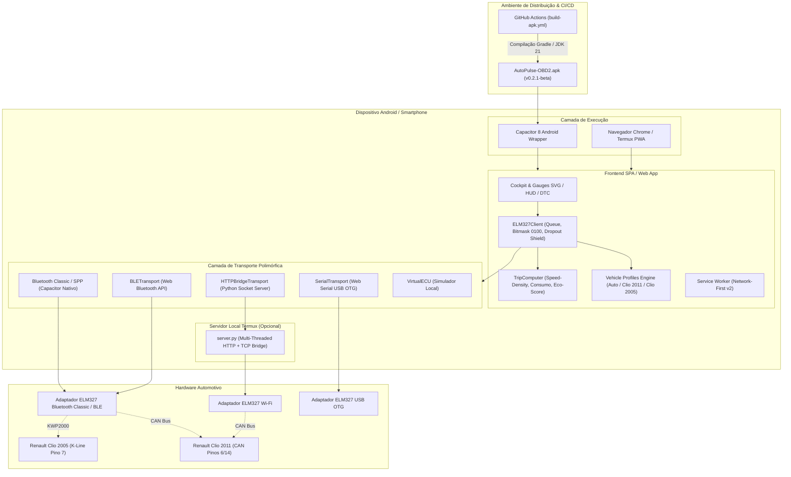

# 🚗 AutoPulse OBD2 (Infocar Style) & Projeto Renault Clio (2005 & 2011)

> **Plataforma Open-Source de Telemetria Automotiva, Diagnóstico de Injeção Eletrônica (ECU) e Computador de Bordo Especializado para Renault Clio II (2005 / K-Line) e Renault Clio (2011 / CAN Bus).**  
> Disponível como **Aplicativo Android Nativo (APK)** via Capacitor e **Progressive Web App (PWA)** de alta performance executável via Termux / Chrome.

[](https://github.com/pucheranni/infocar-obd2/releases/tag/v0.2.1-beta)
[](https://github.com/pucheranni/infocar-obd2/actions)
[](tests/parser.test.js)
[](package.json)
[-orange.svg)](android/gradle.properties)

---

> [!NOTE]
> ### 🚀 Estado Atual do Projeto (`v0.2.1-beta`)
> 
> O projeto evoluiu significativamente de um protótipo web para uma solução híbrida completa testada em bancada e simulador:
> 
> 1. **Instalador Android Direto (.APK):** Disponível para download na release [v0.2.1-beta](https://github.com/pucheranni/infocar-obd2/releases/tag/v0.2.1-beta). O wrapper nativo Android (Capacitor 8 / SDK 35) permite comunicação direta com adaptadores Bluetooth Classic (SPP - o popular "ELM327 mini azul"), contornando a restrição de BLE do Web Bluetooth dos navegadores.
> 2. **Blindagem contra PID Dropouts:** O motor de aquisição decodifica a máscara de bits do comando `0100` ([`parseSupportedPIDs`](file:///c:/Users/BRSOUSAG/OneDrive%20-%20Tetra%20Pak/Desktop/OBD/infocar-obd2/js/obd/elm327.js#L559)), protegendo sensores suportados (temperatura do arrefecimento `0105`, MAP `010B`, TPS `0111`, etc.) de serem desativados por respostas transitórias de `NO DATA`.
> 3. **Consumo Speed-Density para Motores Renault 1.0 16V (D4D):** Motores Clio 1.0/1.6 nacionais não possuem sensor MAF. O cálculo foi migrado para modelo termodinâmico Speed-Density ($m = \frac{P \cdot V}{R \cdot T} \cdot \frac{\text{RPM}}{120}$) usando sensor MAP (`010B`) e IAT (`010F`), com calibração volumétrica ($\eta_v = 0.80$) e estequiometria brasileira Flex-Fuel (E27 / E100).
> 4. **Proteção contra Consumo Fantasma:** Quando a ignição está ligada com motor parado ($\text{RPM} < 300$), a vazão é zerada e nenhum consumo fantasma é integrado.
> 5. **Ergonomia Móvel (Samsung Galaxy S23 e Telas Modernas):** Bottom dock remodelado com respeito estrito à `safe-area-inset-bottom`, eliminando sobreposição da barra de gestos e botões nativos do Android.
> 6. **Pipeline de CI/CD Integrado:** GitHub Actions automatizado com compilação de APKs em ambiente Ubuntu com JDK 21 e upload automático de artefatos release.
> 7. **Assistência Corporativa GPT-Sol:** Skill integrada [`gpt-sol-bridge`](file:///c:/Users/BRSOUSAG/OneDrive%20-%20Tetra%20Pak/Desktop/OBD/infocar-obd2/.agents/skills/gpt-sol-bridge/SKILL.md) para revisão técnica via Microsoft 365 Copilot via CDP (porta 9222).

📖 **Documentação Complementar de Engenharia:**
- [Plano de Melhoria Completo (24 achados, metas e roadmap)](file:///c:/Users/BRSOUSAG/OneDrive%20-%20Tetra%20Pak/Desktop/OBD/infocar-obd2/docs/PLANO_DE_MELHORIA.md)
- [Roteiro de Descoberta Prático para o Adaptador Azul](file:///c:/Users/BRSOUSAG/OneDrive%20-%20Tetra%20Pak/Desktop/OBD/infocar-obd2/docs/ROTEIRO_DESCOBERTA.md)
- [Estado Atual e Próximos Passos](file:///c:/Users/BRSOUSAG/OneDrive%20-%20Tetra%20Pak/Desktop/OBD/infocar-obd2/docs/ESTADO_E_PROXIMOS_PASSOS.md)

---

## 📑 Sumário

1. [Visão Geral & Contexto do Projeto](#1-visão-geral--contexto-do-projeto)
2. [Benchmark & Análise Comparativa de Projetos Open-Source](#2-benchmark--análise-comparativa-de-projetos-open-source)
3. [Dossiê Técnico: Renault Clio 2005 (K-Line) vs Renault Clio 2011 (CAN Bus)](#3-dossiê-técnico-renault-clio-2005-k-line-vs-renault-clio-2011-can-bus)
4. [Arquitetura do Sistema](#4-arquitetura-do-sistema)
5. [Architecture Decision Records (ADRs)](#5-architecture-decision-records-adrs)
   - [ADR-001: PWA Web-First + Local Termux Python Bridge](#adr-001-pwa-web-first--local-termux-python-bridge)
   - [ADR-002: Motor de Perfis de Protocolo Dinâmico (Clio 2005 K-Line vs Clio 2011 CAN)](#adr-002-motor-de-perfis-de-protocolo-dinâmico-clio-2005-k-line-vs-clio-2011-can)
   - [ADR-003: Compatibilidade de Hardware ELM327 & Mitigação de Clones](#adr-003-compatibilidade-de-hardware-elm327--mitigação-de-clones)
   - [ADR-004: Diagnóstico DTC com Dicionário Offline em Português](#adr-004-diagnóstico-dtc-com-dicionário-offline-em-português)
   - [ADR-005: Fila Assíncrona, Polling Prioritário & Watchdog K-Line](#adr-005-fila-assíncrona-polling-prioritário--watchdog-k-line)
   - [ADR-006: Telemetria Flex-Fuel & Cálculo Speed-Density (MAP + IAT)](#adr-006-telemetria-flex-fuel--cálculo-speed-density-map--iat)
   - [ADR-007: Head-Up Display (HUD) Noturno com Inversão Óptica](#adr-007-head-up-display-hud-noturno-com-inversão-óptica)
   - [ADR-008: Empacotamento Android Nativo (Capacitor) para Suporte a Bluetooth Classic](#adr-008-empacotamento-android-nativo-capacitor-para-suporte-a-bluetooth-classic)
   - [ADR-009: Decodificação de Bitmask PID 0100 e Blindagem contra Dropouts Transitórios](#adr-009-decodificação-de-bitmask-pid-0100-e-blindagem-contra-dropouts-transitórios)
6. [Plano de Implementação Faseado (Roadmap)](#6-plano-de-implementação-faseado-roadmap)
7. [Suíte de Testes Automatizados (13 Testes)](#7-suíte-de-testes-automatizados-13-testes)
8. [Guia de Operação e Instalação Prática](#8-guia-de-operação-e-instalação-prática)
   - [Opção A: Instalação via APK Direto (Recomendada para Bluetooth Classic)](#opção-a-instalação-via-apk-direto-recomendada-para-bluetooth-classic)
   - [Opção B: Execução via Termux (PWA / Adaptadores Wi-Fi ou BLE)](#opção-b-execução-via-termux-pwa--adaptadores-wi-fi-ou-ble)
   - [Diagnóstico Rápido no Terminal Interativo](#diagnóstico-rápido-no-terminal-interativo)
9. [Estrutura do Repositório](#9-estrutura-do-repositório)

---

## 1. Visão Geral & Contexto do Projeto

Proprietários de veículos da linha **Renault Clio** enfrentam desafios conhecidos ao utilizar aplicativos universais (como versões genéricas do Torque ou Car Scanner) conectados a adaptadores de baixo custo:
- `BUS INIT: ERROR` ou `UNABLE TO CONNECT` recorrente no **Clio 2005 (K-Line)**;
- Desconexão ou congelamento da leitura após poucos segundos;
- Falha na leitura de temperatura da água ou sonda lambda por dropouts transitórios de dados;
- Medição incorreta de consumo em motores **Hi-Flex** nacionais por falta de sensor MAF e variação da mistura Etanol/Gasolina.

O **AutoPulse OBD2** foi construído como uma plataforma especializada para eliminar esses problemas:
1. **Multiplataforma:** Distribuído tanto como **APK Android Nativo** compilado via GitHub Actions quanto como **PWA** executável via Termux.
2. **Motor de Protocolos e Bitmasking Inteligente:** Identifica automaticamente os PIDs suportados pela ECU pelo mapa de bits do PID `0100`, ignorando timeouts espúrios.
3. **Consumo Físico Speed-Density:** Implementa cálculo estequiométrico preciso utilizando pressão absoluta no coletor (MAP) e temperatura de admissão (IAT) calibrado para motores D4D e K4M.
4. **Cockpit Moderno Inspirado no Infocar:** Gauges circulares SVG de alta fidelidade, cards de consumo médio e instantâneo, pontuação de Eco-Driving, scanner DTC offline e modo HUD espelhado.

---

## 2. Benchmark & Análise Comparativa de Projetos Open-Source

| Projeto GitHub | Tecnologias | Pontos Fortes | Limitações Identificadas | Aplicação no AutoPulse |
| :--- | :--- | :--- | :--- | :--- |
| **[cedricp/ddt4all](https://github.com/cedricp/ddt4all)** | Python, PyQt, ELM327 | Acesso profundo a parâmetros Renault (UCH, Airbag, Injeção) via DDT2000. | Interface desktop pesada, risco de gravação indevida de módulos. | Mapeamento de endereçamentos e cabeçalhos Renault (`ATSH8111F1` e `ATSH7E0`). |
| **[PyRen](https://gitlab.com/pyren/pyren)** | Python, ELM327 | Reimplementação leve do Renault Clip; robusto suporte K-Line. | Linha de comando pura, difícil de operar no celular em condução. | Handshake do protocolo KWP2000 Fast Init e parâmetros keep-alive. |
| **[brendan-w/python-OBD](https://github.com/brendan-w/python-OBD)** | Python | Polling assíncrono, decodificadores de PIDs universais e fila de comandos. | Sem interface gráfica nativa para dispositivos móveis. | Estrutura de fila de comandos, tratamento de timeouts e tabela de conversão física. |
| **[rpwalsh/onboarddiagnosticstool](https://github.com/rpwalsh/onboarddiagnosticstool)** | TypeScript, Web Bluetooth | Comunicação direta pelo navegador via BLE sem dependências nativas. | Não suporta Bluetooth Classic (SPP) nem adaptadores Wi-Fi locais. | Stream assíncrono de buffers seriais e detecção segura do prompt `>`. |

---

## 3. Dossiê Técnico: Renault Clio 2005 (K-Line) vs Renault Clio 2011 (CAN Bus)

A frota nacional do Renault Clio passou por uma transição eletroeletrônica marcante:

### 3.1. Renault Clio 2005 (Clio II Fase 2)
* **Topologia:** **K-Line Física (Pino 7 do DLC)**. Sem barramento CAN na tomada de injeção.
* **Centrais (ECUs) Típicas:** Magneti Marelli IAW 5NR / 5NP, Siemens SIM32 ou Sirius 32/34.
* **Protocolo:** **ISO 14230-4 KWP (Keyword Protocol 2000)** em Fast Init (fallback em 5 bauds).
* **Particularidades Críticas:**
  - Varredura universal (`ATSP0`) costuma esgotar o tempo limite antes de atingir a K-Line;
  - Requer watchdog periódico (`3E 00` / *TesterPresent*) para evitar encerramento de sessão KWP após ~5 segundos de inatividade;
  - Exige microcontrolador genuíno **PIC18F25K80** para geração do pulso de inicialização (25ms low / 25ms high).

### 3.2. Renault Clio 2011 (Clio II Campus / Fase 3)
* **Topologia:** **CAN Bus de Alta Velocidade (Pinos 6 CAN-H e 14 CAN-L)** a 500 kbps (11-bit ID).
* **Centrais (ECUs) Típicas:** Continental SIM32 ou Valeo V42.
* **Protocolo:** **ISO 15765-4 CAN 11/500** (`ATSP6`).
* **Particularidades Críticas:**
  - Respostas com latência inferior a 15ms por requisição;
  - Cabeçalho de envio `7E0` (`ATSH7E0`), resposta da injeção em `7E8`;
  - Ausência de sensor MAF: alimentação de ar calculada via **Speed-Density** (PIDs `010B` MAP e `010F` IAT).

### 3.3. Comparativo da Pinagem do Conector OBD-II (DLC)

```
        _________________________________
       /  1   2   3   4   5   6   7   8  \
      /                                   \
     /    9  10  11  12  13  14  15  16    \
    /_______________________________________\
```

| Pino | Função Padrão | Renault Clio 2005 | Renault Clio 2011 |
| :---: | :--- | :--- | :--- |
| **4 / 5** | Terra do Chassi / Terra do Sinal | Conectado (Terra) | Conectado (Terra) |
| **6** | CAN High (ISO 15765-4) | Ausente/Inativo na Injeção | **Ativo (CAN-H 500k)** |
| **7** | **K-Line (ISO 9141-2 / ISO 14230-4)** | **Ativo Primário (Injeção)** | Secundário / Diagnóstico Auxiliar |
| **14** | CAN Low (ISO 15765-4) | Ausente/Inativo na Injeção | **Ativo (CAN-L 500k)** |
| **16** | Tensão Positiva da Bateria (+12V permanente) | Conectado (+12V) | Conectado (+12V) |

---

## 4. Arquitetura do Sistema



---

## 5. Architecture Decision Records (ADRs)

### ADR-001: PWA Web-First + Local Termux Python Bridge
* **Status:** Aceito e Implementado.
* **Decisão:** Construir a base como Progressive Web App (HTML5/CSS3/ES Modules) operável via navegador ou microservidor local Termux (`server.py`).
* **Consequências:** Agilidade de desenvolvimento, operação offline e portabilidade universal.

### ADR-002: Motor de Perfis de Protocolo Dinâmico
* **Status:** Aceito e Implementado.
* **Decisão:** Perfis dedicados para `clio2011_can` (`ATSP6`, `ATSH7E0`, `ATCAF1`, `ATAT1`), `clio2005_fast` (`ATSP5`, `ATSH8111F1`) e modo padrão `auto` (`ATSP0`).

### ADR-003: Compatibilidade de Hardware ELM327 & Mitigação de Clones
* **Status:** Aceito e Implementado.
* **Decisão:** Tolerância com comandos de inicialização brandos para clones v2.1 em CAN e recomendação do chip PIC18F25K80 para K-Line.

### ADR-004: Diagnóstico DTC com Dicionário Offline em Português
* **Status:** Aceito e Implementado.
* **Decisão:** Decodificador de modos 03 e 07 com banco embarcado [`dtc-db.js`](file:///c:/Users/BRSOUSAG/OneDrive%20-%20Tetra%20Pak/Desktop/OBD/infocar-obd2/js/obd/dtc-db.js) com severidade e causas prováveis para mecânica Renault.

### ADR-005: Fila Assíncrona, Polling Prioritário & Watchdog K-Line
* **Status:** Aceito e Implementado.
* **Decisão:** Fila não bloqueante de promessas com prioridade para RPM/Velocidade e envio automático de `3E 00` (*TesterPresent*) para manter sessões KWP ativas.

### ADR-006: Telemetria Flex-Fuel & Cálculo Speed-Density (MAP + IAT)
* **Status:** Aceito e Implementado.
* **Contexto:** Motores Renault Hi-Flex 1.0 16V (D4D) e 1.6 16V (K4M) não possuem sensor de massa de ar (MAF), inviabilizando fórmulas tradicionais.
* **Decisão:** Implementar modelo Speed-Density no [`TripComputer`](file:///c:/Users/BRSOUSAG/OneDrive%20-%20Tetra%20Pak/Desktop/OBD/infocar-obd2/js/trip.js#L75):
  $$\dot{m}_{\text{ar}} = \frac{\text{MAP} \times V_d \times \eta_v}{R_{\text{ar}} \times T_{\text{IAT}}} \times \left(\frac{\text{RPM}}{120}\right)$$
  - Gasolina nacional (E27): AFR 13.2:1, densidade 745 g/L;
  - Etanol hidratado (E100): AFR 9.0:1, densidade 790 g/L;
  - Proteção contra motor desligado ($\text{RPM} < 300$).

### ADR-007: Head-Up Display (HUD) Noturno com Inversão Óptica
* **Status:** Aceito e Implementado.
* **Decisão:** Modo HUD com inversão geométrica horizontal (`transform: scaleX(-1)`) e contraste elevado para reflexão no para-brisa.

### ADR-008: Empacotamento Android Nativo (Capacitor) para Suporte a Bluetooth Classic
* **Status:** Aceito e Implementado.
* **Contexto:** A Web Bluetooth API restringe-se exclusivamente a dispositivos BLE, impedindo conexão direta do navegador com o adaptador azul ELM327 Bluetooth Classic (SPP).
* **Decisão:** Adicionar invólucro Android nativo utilizando Capacitor 8 (`@capacitor/android` v8.5.2) e pipeline de build automatizado via GitHub Actions com compilação direta para SDK 35 (`compileSdkVersion = 35`).
* **Consequências:** O usuário pode instalar diretamente o arquivo `app-debug.apk` e usufruir de conexão Bluetooth Classic sem limitações do navegador.

### ADR-009: Decodificação de Bitmask PID 0100 e Blindagem contra Dropouts Transitórios
* **Status:** Aceito e Implementado.
* **Contexto:** Respostas ocasionais de `NO DATA` em barramentos CAN ou K-Line causavam o descarte prematuro de PIDs essenciais (como temperatura do arrefecimento `0105` ou sensor MAP `010B`).
* **Decisão:** Implementar a decodificação da máscara de bits de 32 bits retornada pelo comando `0100` (`parseSupportedPIDs`). PIDs presentes nessa máscara são registrados em `ecuSupportedPids` e ficam imunes ao descarte em `unsupportedPids`.

---

## 6. Plano de Implementação Faseado (Roadmap)

### 📌 Fase 1: Fundação de Hardware & Handshake Específico (Concluída ✅)
- [x] Criação do microservidor Python `server.py` no Termux.
- [x] Implementação da camada de transporte abstrata (BLE, USB OTG, Wi-Fi Socket, Simulador).
- [x] Implementação dos perfis `clio2011_can`, `clio2005_fast` e `clio2005_slow`.
- [x] Seletor visual de perfis e persistência em `localStorage`.

### 📌 Fase 2: Telemetria & Monitoramento em Tempo Real (Concluída ✅)
- [x] Mostradores circulares com animação SVG contínua (`dasharray`/`dashoffset`).
- [x] Conta-giros com indicação de corte de giro (*redline*).
- [x] Monitor de temperatura com alerta em >100°C.
- [x] Tensão de bateria com diagnóstico de alternador (`ATRV`).
- [x] Watchdog de *Keep-Alive* K-Line.

### 📌 Fase 3: Diagnóstico DTC & Limpeza de Falhas (Concluída ✅)
- [x] Varredura de códigos Modo 03 (confirmados) e Modo 07 (pendentes).
- [x] Banco de dados offline de DTCs em português com causas prováveis Renault.
- [x] Procedimento de limpeza de erros (Modo 04 / Reset da luz da injeção).
- [x] Tratamento de respostas multi-frame ISO-TP (linhas `0:` e `1:`).

### 📌 Fase 4: Computador de Bordo & Otimização Hi-Flex (Concluída ✅)
- [x] Módulo `trip.js` com cálculo Speed-Density (MAP + IAT) para motores sem MAF.
- [x] Integração temporal contínua baseada em delta de relógio real (`dt`).
- [x] Filtro de aceleração brusca e cálculo de pontuação Eco-Driving.
- [x] Cards dinâmicos no Cockpit: Consumo Instantâneo (km/L ou L/h) e Média da Viagem.
- [x] Blindagem contra acúmulo fantasma de combustível com motor desligado ($\text{RPM} < 300$).

### 📌 Fase 5: Distribuição Nativa & Ergonomia Mobile (Concluída ✅)
- [x] Empacotamento nativo Android com Capacitor 8 (SDK 35 / Android 15).
- [x] Esteira automatizada no GitHub Actions gerando release com APK direto ([v0.2.1-beta](https://github.com/pucheranni/infocar-obd2/releases/tag/v0.2.1-beta)).
- [x] Reestruturação da barra de navegação inferior (dock) para Samsung Galaxy S23 e navegação por gestos do Android (`safe-area-inset-bottom`).
- [x] Blindagem de PIDs confirmados via bitmask do PID `0100`.

### 📌 Fase 6: Validação em Campo & Expansões Futuras (Próximos Passos 🚀)
- [ ] Validação com conexão física no conector OBD-II do Clio 2011 e Clio 2005.
- [ ] Data Logging para exportação de telemetria completa da viagem em arquivo `.csv`.
- [ ] Módulo de teste de aceleração 0-100 km/h com disparo automático via telemetria CAN.
- [ ] Integração com identificadores da UCH Renault (estado de portas, travas e luzes).

---

## 7. Suíte de Testes Automatizados (13 Testes)

O repositório possui uma suíte de testes unitários automatizados em [`tests/parser.test.js`](file:///c:/Users/BRSOUSAG/OneDrive%20-%20Tetra%20Pak/Desktop/OBD/infocar-obd2/tests/parser.test.js) utilizando o executor nativo do Node.js (`node --test`), sem dependências pesadas externas:

```bash
npm test
```

### Resultados da Suíte:
```text
✔ CAN: pula o byte de contagem e decodifica dois DTCs
✔ K-Line: sem byte de contagem
✔ CAN multi-frame: ignora marcadores 0:/1: e o cabeçalho de tamanho
✔ CAN sem falhas devolve lista vazia
✔ Mode 07 usa o prefixo 47 e marca como pendente
✔ Ida e volta: simulador -> parser (CAN)
✔ VIN multi-frame do simulador é remontado
✔ Trip: distância e combustível seguem o tempo real, não o número de chamadas
✔ Trip: variação lenta de velocidade não conta como aceleração brusca
✔ Trip: aceleração real (+15 km/h em 1 s) é contada uma vez
✔ PID 0100: decodifica mapa de bits do Clio 2011 (BE 3E B8 11)
✔ ELM327: PID suportado pela ECU nunca é jogado em unsupportedPids em NO DATA transitório
✔ Trip: motor desligado (RPM < 300) zera consumo e não acumula combustível fantasma

ℹ tests 13 | pass 13 | fail 0 | duration_ms ~380ms
```

---

## 8. Guia de Operação e Instalação Prática

### Onde fica a tomada OBD-II no Renault Clio?
Nos modelos **Clio II (2005 e 2011)**, o conector de 16 pinos localiza-se **no console central, logo abaixo do cinzeiro/porta-moedas**, à frente da alavanca de câmbio. Basta puxar a tampa plástica ou retirar o cinzeiro removível.

---

### Opção A: Instalação via APK Direto (Recomendada para Bluetooth Classic)
Ideal para uso com o adaptador mini azul ELM327 ou qualquer scanner Bluetooth clássico:
1. No smartphone Android, acesse a página de releases do projeto:
   👉 **[Download AutoPulse OBD2 APK (v0.2.1-beta)](https://github.com/pucheranni/infocar-obd2/releases/tag/v0.2.1-beta)**
2. Baixe o arquivo `app-debug.apk` e instale no dispositivo (autorize a instalação de fontes desconhecidas se solicitado).
3. Abra o **AutoPulse OBD2**, emparelhe seu adaptador no menu Bluetooth do Android e conecte.

---

### Opção B: Execução via Termux (PWA / Adaptadores Wi-Fi ou BLE)
Para quem prefere rodar localmente sem compilação:
1. Abra o **Termux** no Android:
   ```bash
   cd ~/infocar-obd2
   python server.py
   ```
2. Abra o Chrome no celular e acesse `http://localhost:8080`.
3. Toque no menu do Chrome e selecione **"Adicionar à tela inicial"** para instalar como PWA.

---

### Diagnóstico Rápido no Terminal Interativo
Na aba **Terminal** do aplicativo, envie comandos manuais para checar a resposta imediata da central:

| Comando | Função no Clio | Resposta Típica Esperada |
| :--- | :--- | :--- |
| `ATRV` | Mede a voltagem da bateria pelo pino 16 | `12.4V` (desligado) / `14.2V` (alternador ativo) |
| `ATDP` | Exibe o protocolo ativo | `ISO 15765-4 (CAN 11/500)` ou `ISO 14230-4 KWP (FAST)` |
| `0100` | Mapa de bits de PIDs suportados | `41 00 BE 3E B8 11` (PIDs suportados pela ECU) |
| `010C` | Rotação do motor (RPM) | `41 0C 0B 20` (~712 RPM em marcha lenta) |
| `010B` | Pressão absoluta no coletor (MAP) | `41 0B 23` (35 kPa em marcha lenta) |
| `010F` | Temperatura do ar de admissão (IAT) | `41 0F 46` (30°C) |
| `03` | Solicita códigos de falha armazenados | `43 00` (sem falhas) ou `43 01 03 00` (ex: P0300) |
| `04` | Limpa a memória de avarias e apaga luz da injeção | `44` ou `OK` |

---

## 9. Estrutura do Repositório

```text
infocar-obd2/
├── .agents/
│   └── skills/
│       └── gpt-sol-bridge/          # Skill de assistência e diagnóstico com Microsoft Copilot (CDP 9222)
├── .github/
│   └── workflows/
│       └── build-apk.yml            # Pipeline GitHub Actions de compilação do APK e release
├── android/                         # Projeto nativo Android (Capacitor 8 / SDK 35 / Gradle)
│   ├── app/
│   │   ├── build.gradle
│   │   └── src/main/assets/public/  # Bundle web sincronizado com o app nativo
│   ├── gradle.properties            # Definição de compileSdkVersion=35
│   └── gradlew                      # Wrapper do Gradle
├── css/
│   └── styles.css                   # Tema escuro esportivo, gauges SVG, modo HUD e safe-area dock
├── docs/
│   ├── ESTADO_E_PROXIMOS_PASSOS.md  # Resumo de engenharia e roteiro de transição
│   ├── PLANO_DE_MELHORIA.md         # Análise de 24 achados técnicos e arquitetura
│   └── ROTEIRO_DESCOBERTA.md        # Roteiro prático para testes com o adaptador azul
├── js/
│   ├── app.js                       # Controlador mestre, persistência de UI e Wake Lock
│   ├── trip.js                      # Computador de bordo, Speed-Density (MAP+IAT) e Eco-Score
│   └── obd/
│       ├── dtc-db.js                # Dicionário offline de códigos DTC em português
│       ├── elm327.js                # Driver ELM327, fila assíncrona, bitmask 0100 e recuperação
│       ├── pids.js                  # Catálogo de PIDs e fórmulas de conversão física
│       ├── simulator.js             # Simulador de ECU virtual com suporte CAN multi-frame
│       └── transports/
│           ├── ble.js               # Transporte Web Bluetooth API (BLE 4.0/5.0)
│           ├── http-bridge.js       # Transporte protegido para adaptador Wi-Fi (server.py)
│           ├── serial.js            # Transporte Web Serial (USB OTG)
│           └── websocket.js         # Transporte WebSocket para pontes remotas
├── tests/
│   └── parser.test.js               # Suíte com 13 testes automatizados (node --test)
├── capacitor.config.json            # Configuração do Capacitor (com.autopulse.obd2)
├── index.html                       # Cockpit SPA responsivo com gauges e bottom dock
├── icon.svg                         # Ícone vetorial automotivo do app
├── manifest.json                    # Manifesto PWA para instalação no Android
├── package.json                     # Scripts de teste, build e dependências Capacitor
├── server.py                        # Servidor local Python com proteção anti-CSRF e socket TCP
├── start.sh                         # Script de inicialização no Termux com termux-wake-lock
└── sw.js                            # Service Worker com estratégia Network-First v2
```

---

*AutoPulse OBD2 • Desenvolvido com foco em engenharia automotiva e telemetria precisa para Renault.*
