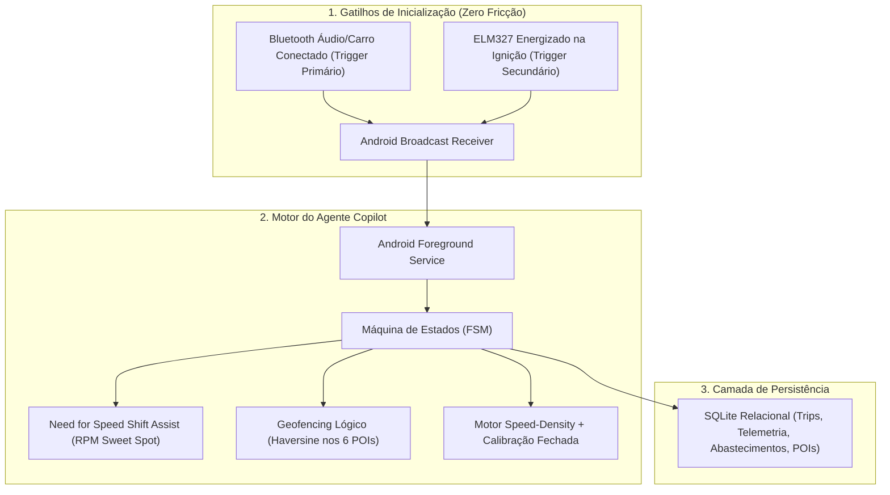

# 🧠 AutoPulse Copilot: Agente Interno de Gestão Veicular Inteligente

> **Documento de Requisitos, Arquitetura e Especificação Funcional (Revisado & Aprovado pelo GPT-Sol)**  
> **Veículo Principal:** Renault Clio II Campus 1.0 16V Hi-Flex (D4D 760 - 2011)  
> **Localidade / Região:** Campinas e RMC (Jardim Chapadão / Valinhos / Monte Mor / Barão Geraldo / Mauá / São Paulo)  
> **Objetivo:** Transformar o AutoPulse OBD2 de um monitor passivo em um **Agente Inteligente de Gerenciamento 360°** do veículo, com automação total de viagens (Zero-Click), assistente de condução dinâmico (estilo Need for Speed RPM Sweet Spot), auditoria financeira de abastecimentos e detecção semântica de rotas habituais.

---

## 1. Visão do Produto & Filosofia "Zero Fricção"

O condutor não precisa operar o celular enquanto entra, dirige ou sai do carro. O sistema opera como um **copiloto autônomo, reativo e inteligente**:
1. **Acorda e conecta sozinho** através do gatilho primário do Bluetooth de mídia do carro ou detecção do ELM327 na ignição;
2. **Assiste a condução em tempo real:** Indicador de troca de marcha ideal (*Shift Light & Sweet Spot* estilo Need for Speed) otimizando consumo ou potência para o motor Renault D4D 16V;
3. **Identifica a origem e o destino** comparando as coordenadas geográficas com o catálogo finito de rotas habituais via cálculo leve de Haversine;
4. **Totaliza e fecha a viagem (Trip A/B)** sem necessidade de intervenção humana quando o carro estaciona por mais de 3 minutos;
5. **Audita custos e abastecimentos** cruzando os litros inseridos na bomba com o consumo termodinâmico Speed-Density, autoajustando o fator de calibração em malha fechada;
6. **Dorme com economia máxima de bateria** quando fora do alcance do carro, operando com máquina de estados explícita e backoff adaptativo.

---

## 2. Pilares de Funcionalidade & Arquitetura Aprovada (GPT-Sol)



---

## 3. Assistente de Condução Dinâmico: "Need for Speed" Shift & Sweet Spot

Inspirado nos indicadores de troca de marcha de alta precisão (estilo Need for Speed / Telemetria de Pista), o aplicativo avalia o mapa de torque e eficiência térmica do motor **Renault 1.0 16V Hi-Flex (D4D)**:
- **Cilindrada:** 999 cm³ (4 cilindros, 16 válvulas)
- **Torque Máximo:** 10,1 kgfm (Gasolina) / 10,3 kgfm (Etanol) a **4.250 RPM**
- **Potência Máxima:** 76 cv (Gasolina) / 77 cv (Etanol) a **5.750 RPM**
- **Faixa de Eficiência Térmica (Cruzeiro Econômico):** **1.800 a 2.500 RPM**

### Modos do Assistente de Marcha (Shift Light)

| Modo | Faixa de RPM (D4D 16V) | Feedback Visual no Cockpit | Propósito de Condução |
| :--- | :--- | :--- | :--- |
| **Zona Baixa (Sub-torque)** | $< 1.600 \text{ RPM}$ | Indicador Cinza / Alerta de "Reduzir Marcha" | Evita cabeceamento do motor e estresse no virabrequim sob carga |
| **Eco Sweet Spot (Perfeita)** | **$1.800 - 2.500 \text{ RPM}$** | **Glow Verde Neon Pulsante ("ECO SHIFT")** | Ponto de menor consumo específico de combustível (BSFC) |
| **Faixa Neutra / Transição** | $2.500 - 3.800 \text{ RPM}$ | Barra Azul Ciano Estável | Condução urbana progressiva |
| **Power Sweet Spot (Torque Máx)** | **$4.000 - 4.500 \text{ RPM}$** | **Glow Âmbar / Dourado Esportivo** | Ultrapassagens e subidas de serra (entrega máxima de torque) |
| **Corte / Redline** | $> 5.800 \text{ RPM}$ | **Alerta Vermelho Flutuante ("SHIFT UP!")** | Proteção contra sobre-giro |

---

## 4. Especificação das Rotas Frequentes (Mapeamento Campinas & SP)

O condutor possui um conjunto finito e determinístico de trajetos mapeados:

| ID POI | Ponto de Interesse (POI) | Endereço / Localização | Finalidade / Contexto |
| :--- | :--- | :--- | :--- |
| `POI_CASA` | **Casa** | Rua Padre Camargo de Lacerda, 400 - CEP 13070-277, Campinas | Ponto base de partida e descanso |
| `POI_A2E` | **A2Z** | Valinhos / SP | Deslocamento centro 1 |
| `POI_TRAPA` | **Tetra Pak ("Trapa")** | Monte Mor / Rod. Campinas-Monte Mor | Trabalho corporativo |
| `POI_UNICAMP` | **Unicamp** | Barão Geraldo, Campinas | Universidade / Campus acadêmico |
| `POI_TEXAS` | **Super Texas Carnes** | São Paulo / SP | Ponto de destino habitual (casa da sogra) |
| `POI_FOZ_MAUA` | **Rua Foz do Iguaçu / Mauá** | Jardim Oratório, Mauá / SP | Perna familiar e pernoite |

### Matriz de Rotas Habitual:
* **Rota 1:** `Casa ➔ A2Z (Valinhos)` | `A2Z ➔ Casa`
* **Rota 2:** `Casa ➔ Tetra Pak (Monte Mor)` | `Tetra Pak ➔ Casa`
* **Rota 3:** `Casa ➔ Unicamp (Barão Geraldo)` | `Unicamp ➔ Casa`
* **Rota 4:** `Casa ➔ Super Texas Carnes (São Paulo)`
* **Rota 5:** `Super Texas Carnes ➔ Rua Foz do Iguaçu (Mauá)`
* **Rota 6:** `Mauá / São Paulo ➔ Casa (Campinas)`

### Geofencing Lógico Leve (Recomendação GPT-Sol):
- Não sobrecarregar a bateria com serviços nativos pesados de geofencing.
- Durante a viagem ativa, checar a posição GPS a cada 20-30 segundos e calcular a distância para os 6 POIs usando a fórmula de **Haversine**:
  $$d = 2R \cdot \arcsin \left( \sqrt{\sin^2\left(\frac{\Delta \phi}{2}\right) + \cos(\phi_1)\cos(\phi_2)\sin^2\left(\frac{\Delta \lambda}{2}\right)} \right)$$
- **Critério de Chegada:** Distância $< 200\text{m}$ do POI por mais de 180 segundos com $\text{RPM} = 0$ e $\text{Velocidade} = 0 \rightarrow$ Encerra a Trip, arquiva no SQLite e emite notificação executiva.

---

## 5. Conexão Autônoma "Zero Preguiça" & Máquina de Estados Finita

Para eliminar bugs de sincronismo e drenagem de bateria, a arquitetura implementa a máquina de estados estrita recomendada pelo GPT-Sol:

```
[IDLE_STANDBY]
      │  (BT Áudio do Carro pareia OU ELM327 detectado)
      ▼
[CONNECTING] ──(Falha após 3 tentativas)──► [BACKOFF_SLEEP]
      │  (Handshake ATZ -> ATSP6 -> 0100 OK)
      ▼
[CONNECTED]
      │  (RPM > 300 detectado)
      ▼
[TRIP_ACTIVE] (Amostragem adaptativa: 1Hz dinâmica / 5s cruzeiro)
      │  (RPM = 0 e Vel = 0 por > 180s próximo a POI)
      ▼
[PARKED_CONSOLIDATING] (Gera resumo financeiro, grava SQLite)
      │
      ▼
[IDLE_STANDBY]
```

### Backoff Inteligente de Energia:
- **0 a 5 min após desligar:** Escuta a cada 30 segundos;
- **5 a 30 min:** Escuta a cada 5 minutos;
- **Acima de 30 min:** Modo *Deep Sleep* com verificação a cada 15-20 minutos (consumo < 0.2% de bateria/hora).

---

## 6. Módulo Financeiro: Auditoria de Abastecimento & Calibração em Malha Fechada

### 6.1. Formulário de Abastecimento Rápido (Interface One-Tap)
- **Atalhos Rápidos de Volume:** `[Tanque Cheio]` • `[20 Litros]` • `[35 Litros]` • `[40 Litros]` • `[Campo Livre]`;
- **Seletor de Combustível:** `Etanol (R$ 3,50/L)` | `Gasolina (R$ 5,89/L)`;
- **Odômetro no Painel:** Registro base (ex: `132.350 km`).

### 6.2. Algoritmo de Calibração Seguro (Aprovado pelo GPT-Sol)
Para não descalibrar a física do motor com ruídos de temperatura ou enchimento de gargalo:
1. **Regra de Ouro:** A recalibração automática só é disparada em abastecimentos com volume $> 15 \text{ Litros}$;
2. **Isolamento de $\eta_v$:** Mantém a eficiência volumétrica base do motor D4D estável ($\eta_v = 0.80$) e ajusta exclusivamente o fator global de correção de combustível (`fuelCorrectionFactor`):
   $$\text{fuelCorrectionFactor}_{\text{novo}} = \text{fuelCorrectionFactor}_{\text{atual}} \times \left( \frac{\text{Litros Reais da Bomba}}{\text{Litros Integrados pelo App}} \right)$$
3. **Filtro de Amortecimento:** Aplica média ponderada exponencial ($90\%$ histórico / $10\%$ novo tanque) para evitar que um bico de posto descalibrado distorça as médias anteriores.

---

## 7. Esquema do Banco de Dados Relacional (SQLite)

Conforme orientação do GPT-Sol, o armazenamento migrará de localStorage para **SQLite estruturado** via plugin Capacitor:

```sql
-- Viagens Consolidadas
CREATE TABLE trips (
    id TEXT PRIMARY KEY,
    start_time INTEGER NOT NULL,
    end_time INTEGER,
    origin_poi_id TEXT,
    destination_poi_id TEXT,
    distance_km REAL DEFAULT 0,
    duration_minutes REAL DEFAULT 0,
    fuel_consumed_liters REAL DEFAULT 0,
    cost_reais REAL DEFAULT 0,
    avg_speed REAL DEFAULT 0,
    max_speed REAL DEFAULT 0,
    eco_score INTEGER DEFAULT 100,
    hard_accels INTEGER DEFAULT 0,
    hard_brakes INTEGER DEFAULT 0,
    idle_time_seconds INTEGER DEFAULT 0
);

-- Amostras de Telemetria (Amostragem Adaptativa)
CREATE TABLE telemetry_samples (
    id INTEGER PRIMARY KEY AUTOINCREMENT,
    trip_id TEXT REFERENCES trips(id),
    timestamp INTEGER NOT NULL,
    rpm INTEGER,
    speed INTEGER,
    map_kpa INTEGER,
    iat_celsius INTEGER,
    coolant_temp INTEGER,
    instant_kml REAL,
    lat REAL,
    lng REAL
);

-- Registro de Abastecimentos e Calibração
CREATE TABLE fuelings (
    id TEXT PRIMARY KEY,
    date INTEGER NOT NULL,
    odometer_km REAL NOT NULL,
    liters REAL NOT NULL,
    price_per_liter REAL NOT NULL,
    fuel_type TEXT NOT NULL,
    is_full_tank BOOLEAN DEFAULT 1,
    app_estimated_liters REAL,
    applied_correction_factor REAL
);

-- Catálogo de Pontos de Interesse (POIs)
CREATE TABLE pois (
    id TEXT PRIMARY KEY,
    name TEXT NOT NULL,
    address TEXT,
    latitude REAL NOT NULL,
    longitude REAL NOT NULL,
    radius_meters INTEGER DEFAULT 200
);
```

---

## 8. Cronograma de Implementação Imediata

1. **Sprint 1 (Condução NFS & Interface de Abastecimento):**
   - Implementar o *Need for Speed Shift Light* no cockpit com faixas para motor Renault D4D 16V (1.800-2.500 RPM Eco / 4.000-4.500 RPM Power).
   - Criar modal de registro rápido de abastecimento com botões `20L`, `35L`, `40L`, `Tanque Cheio` e preços pré-definidos (R$ 3,50 / R$ 5,89).
2. **Sprint 2 (POIs e Geofencing Haversine):**
   - Criar catálogo `js/routes/poi-manager.js` com os 6 pontos definidos (Chapadão, Valinhos, Monte Mor, Barão Geraldo, Mauá, SP).
   - Implementar monitor de aproximação Haversine integrado ao loop de telemetria.
3. **Sprint 3 (SQLite & Máquina de Estados):**
   - Configurar o `@capacitor-community/sqlite` para gravação de histórico de viagens e abastecimentos.
   - Implementar a Máquina de Estados Finita e o Foreground Service com trigger de Bluetooth de áudio do carro.
