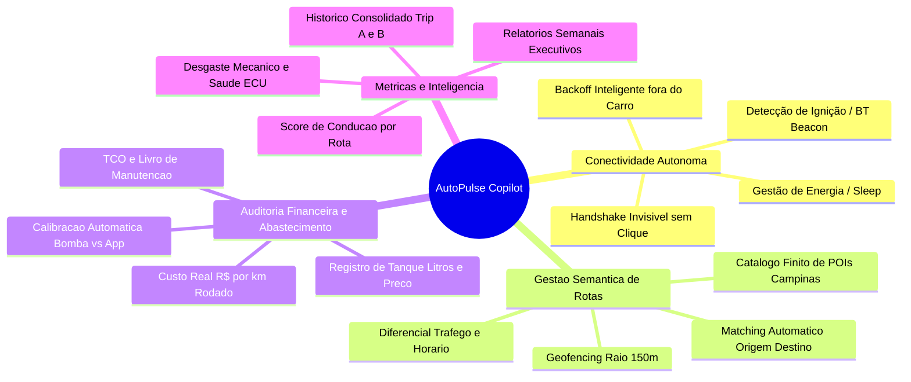

# 🧠 AutoPulse Copilot: Agente Interno de Gestão Veicular Inteligente

> **Documento de Requisitos, Arquitetura e Especificação Funcional**  
> **Veículo Principal:** Renault Clio II Campus 1.0 16V Hi-Flex (2011)  
> **Localidade / Região:** Campinas e Região Metropolitana (Padre Anchieta / Barão Geraldo / Sousas / Mauá / Monte Mor)  
> **Objetivo:** Transformar o AutoPulse OBD2 de um monitor passivo em um **Agente Inteligente de Gerenciamento 360°** do veículo, com automação total de viagens (Zero-Click), auditoria financeira de abastecimentos e detecção semântica de rotas habituais.

---

## 1. Visão do Produto & Filosofia "Zero Fricção"

O motorista não deve precisar operar o celular enquanto entra, dirige ou sai do carro. O sistema deve operar como um **copiloto autônomo e invisível** que:
1. **Acorda e conecta sozinho** assim que a ignição do veículo energiza o adaptador OBD2;
2. **Identifica a origem e o destino** comparando as coordenadas com o catálogo de rotas frequentes;
3. **Totaliza e fecha a viagem (Trip A/B)** sem necessidade de apertar botões;
4. **Calcula o balanço financeiro real** cruzando litros abastecidos (ex: 40L Etanol) com os dados termodinâmicos de injeção e odometria;
5. **Dorme com economia de bateria** quando fora do alcance do carro, fazendo checagens esparsas com backoff inteligente.

---

## 2. Pilares de Funcionalidade

---

## 3. Especificação das Rotas Frequentes (Mapeamento Geográfico Campinas)

O condutor opera em um conjunto finito e determinístico de trajetos. Cada ponto de interesse (POI) possui uma coordenada central e uma cerca geográfica (*geofence*) de 150 a 250 metros:

| ID POI | Ponto de Interesse (POI) | Região / Bairro (Campinas) | Contexto de Uso |
| :--- | :--- | :--- | :--- |
| `POI_CASA` | **Casa** | Região Padre Anchieta / Campinas | Ponto de partida e retorno base |
| `POI_A2E` | **A2E** | Campinas | Trabalho / Estudo / Parceiro |
| `POI_TRAPA` | **Tetra Pak ("Trapa")** | Monte Mor / Campinas | Local de trabalho corporativo |
| `POI_UNICAMP` | **Unicamp** | Barão Geraldo, Campinas | Universidade / Campus |
| `POI_TEXAS` | **Texas** | Campinas | Ponto frequente de convivência |
| `POI_GIOVANI` | **Giovani Grande** | Campinas | Parada habitual |
| `POI_FOZ_MAUA` | **Rua Foz do Iguaçu / Mauá** | Jardim Mauá / Vila Nova | Residência / Família / Destino chave |

### Matriz de Rotas Automatizadas (Classificação Direta)

O aplicativo identifica a rota combinando o ponto de partida ($POI_{\text{origem}}$) e o ponto de parada ($POI_{\text{destino}}$):

* **Rota 1:** `Casa ➔ A2E` | `A2E ➔ Casa`
* **Rota 2:** `Casa ➔ Tetra Pak` | `Tetra Pak ➔ Casa` (Trabalho diário)
* **Rota 3:** `Casa ➔ Unicamp` | `Unicamp ➔ Casa` (Perna acadêmica)
* **Rota 4:** `Casa ➔ Texas / Giovani Grande` | `Texas ➔ Rua Foz do Iguaçu / Mauá`
* **Rota 5:** `Mauá / Foz do Iguaçu ➔ Casa` ou `Mauá ➔ Texas`

> **Regra de Classificação:**  
> Se o veículo permaneceu desligado ($\text{RPM} = 0$) por mais de 5 minutos dentro do raio de um POI, a viagem anterior é finalizada e catalogada com o nome da rota, e uma nova viagem é iniciada ao religar a ignição.

---

## 4. Conexão Autônoma "Zero Preguiça" & Polling Adaptativo

### 4.1. O Ciclo de Vida da Conexão
1. **Carro Desligado:** O pino 16 do OBD2 está desenergizado ou o adaptador entra em modo de repouso. O aplicativo entra em estado `IDLE_SCANNING`.
2. **Backoff Inteligente:**
   - Minuto 0 a 5 após sair do carro: escuta leve a cada 30 segundos;
   - Minuto 5 a 30: escuta a cada 2 minutos;
   - Acima de 30 minutos: ciclo de vigília a cada 5 a 10 minutos (poupando bateria do celular).
3. **Entrada no Carro & Ignição:**
   - O adaptador ELM327 energiza e começa a anunciar o broadcast Bluetooth (SPP/BLE);
   - O app Android (via serviço nativo de segundo plano) detecta a presença do MAC address cadastrado;
   - Dispara imediatamente o handshake silencioso (`ATZ` ➔ `ATSP6` ➔ `0100`);
   - Transita para `CONNECTED_DRIVING` e inicia a gravação da telemetria da viagem.
4. **Desconexão:** Ao desligar o motor e cessar o link, aguarda 45 segundos, salva a telemetria, sintetiza o resumo e notifica no smartphone:  
   *“Chegada em Tetra Pak concluída: 18.4 km • 14.8 km/L • Custo: R$ 5,20 • EcoScore: 94”*.

---

## 5. Módulo Financeiro: Auditoria de Abastecimento & Calibração

### 5.1. Fluxo de Entrada de Dados (Abastecimento)
Ao abastecer, o condutor informa:
- **Volume:** ex.: `40.0 Litros`
- **Combustível:** `Etanol` ou `Gasolina`
- **Preço por Litro:** ex.: `R$ 3,69`
- **Odômetro no Painel:** ex.: `142.350 km`

### 5.2. Conciliação Automática com a Injeção Eletrônica
1. O app registra a data/hora e odômetro do abastecimento;
2. Conforme o carro roda, o módulo [`TripComputer`](../js/trip.js) soma o consumo teórico Speed-Density:
   $$\text{Litros Calculados} = \sum \left( \frac{\dot{m}_{\text{ar}}}{\text{AFR} \times \rho_{\text{combustível}}} \times \Delta t \right)$$
3. No próximo abastecimento em tanque cheio, o sistema calcula o fator de desvio real:
   $$\text{Fator de Calibração} = \frac{\text{Litros Reais da Bomba}}{\text{Litros Integrados pelo App}}$$
4. O app atualiza automaticamente a variável `this.calibration` no `trip.js`, eliminando gradualmente o erro de medição para menos de 1,5%!

---

## 6. Métricas & KPIs de Gestão

### 6.1. Métricas de Viagem (Trip A e B)
- **Trip A (Perna Atual):** Odômetro parcial, tempo em trânsito, tempo em marcha lenta (parado em semáforos), consumo instantâneo e médio, gasto em Reais ($\text{Litros} \times \text{Preço/L}$).
- **Trip B (Consolidado do Tanque Atual / Semanal):** Quilometragem total rodada com o tanque, gasto acumulado, autonomia estimada restante baseada na taxa de consumo recente.

### 6.2. Métricas de Rotas Frequentes
- **Custo Médio por Rota:** Quanto custa, em média, ir de *Casa até a Tetra Pak* ou até a *Unicamp* com Etanol vs Gasolina.
- **Eficiência Comparativa de Horário:** Comparação entre o trajeto das 07:30 vs 08:30 (impacto do trânsito na perda de combustível por marcha lenta).

### 6.3. Métricas de Saúde & Manutenção Preventiva
- **Temperatura Máxima do Motor por Trajeto:** Monitoramento de estresse térmico da válvula termostática e ventoinha no trânsito de Campinas.
- **Saúde do Alternador & Bateria:** Tensão sob carga matinal (`ATRV`) registrando sinais precoces de degradação da bateria antes de falha de partida.
- **Score de Desgaste (EcoScore):** Contagem de acelerações bruscas ($> 12 \text{ km/h/s}$) e frenagens fortes ($< -15 \text{ km/h/s}$) para preservação de pastilhas e pneus.

---

## 7. Próximos Passos de Engenharia

1. **Camada de Localização (GPS Geofencing):** Integrar API de geolocalização nativa para identificação automática dos POIs de Campinas.
2. **Serviço de Segundo Plano no Android (Capacitor Background Runner / Bluetooth Scanner):** Permitir o pareamento autônomo sem necessidade de abrir a tela do app.
3. **Módulo de Armazenamento Local IndexedDB:** Persistência de histórico de todas as viagens com exportação JSON/CSV.
4. **Interface de Abastecimento Rápido:** Tela com botões rápidos (Tanque Cheio, 20L, 30L, 40L, Etanol/Gasolina).
