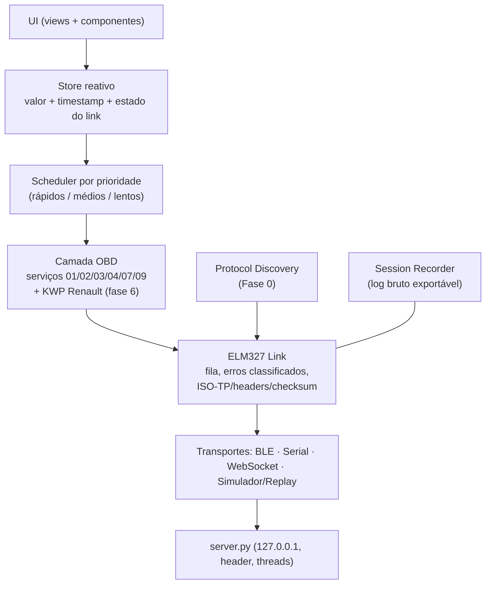
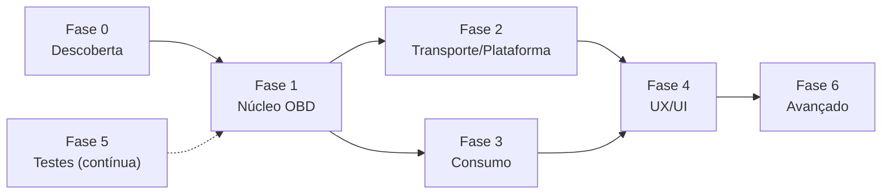

# Plano de Melhoria — AutoPulse OBD2 → produto funcional com UX excelente

> **Cópia versionada no projeto** (original gerado na conversa de 03/10/2026).
> Contexto e estado atual: [`ESTADO_E_PROXIMOS_PASSOS.md`](ESTADO_E_PROXIMOS_PASSOS.md) ·
> Teste manual com o adaptador azul: [`ROTEIRO_DESCOBERTA.md`](ROTEIRO_DESCOBERTA.md)

## 0. Veredito e limites da análise

**Estado real:** protótipo de UI funcional **contra o simulador**. Nada foi validado em carro real, e o simulador esconde vários bugs (devolve respostas "limpas" que um ELM327 real não devolve).

**Limites da análise:** o código foi lido por inspeção estática. O ambiente do agente não conseguiu executar comandos (`permission denied` no `bash`), então **nada foi executado nem testado em hardware**.

### 0.1 Correções ao que foi afirmado antes

| Afirmação anterior | Situação real |
| :--- | :--- |
| "Clio 2011 = CAN 500k (`ATSP6`)" | **Não confirmado.** No Brasil muitos carros até ~2014 ainda usam K-Line mesmo com OBD-BR2. Deve ser **detectado**, não presumido. |
| "Clio 2005 responde em `ATSH8111F1` (endereço 0x11) para Mode 01" | **Provavelmente errado para PIDs genéricos.** No EOBD o endereço funcional é `0x33` (header padrão do ELM, `81 33 F1`). O `0x11` é para serviços **proprietários Renault**. Um Clio 2005 brasileiro pode **nem suportar Mode 01**. |
| Perfil usava `ATWM…` junto com `ATSW00` | Contraditório: `ATSW00` desliga o wakeup automático, anulando o `ATWM`. |
| "AFR gasolina 14.7" | Gasolina brasileira (E27) ≈ 13,2–13,5. |
| "Foram inspecionados os repositórios…" | Foram buscas web e resumos; **o código de ddt4all/PyRen não foi lido**. |
| "Fases concluídas ✅" | Significa "roda no simulador", não "validado". |
| "Tomada OBD fica sob o cinzeiro/console central" (README 7.1) | **Não verificado.** Confirmar a localização real no carro. |

> [!IMPORTANT]
> A primeira fase não é feature: é **descobrir o que cada Clio realmente fala**.

### 0.2 Progresso já aplicado (03/10/2026 — **não testado**, sem shell)

| Item | Mudança |
| :--- | :--- |
| A1 | `parseDTCResponse` pula o byte de contagem em CAN e remove marcadores `0:`/`1:`; simulador emite o byte de contagem. |
| A11 (parcial) | Perfis K-Line sem `0x11`, sem `ATSW00`/`ATWM`, sem keep-alive manual; `ATH0`; timeout do 1º `0100` = 8 s. |
| B1, B2 | `trip.js` integra distância/combustível por tempo real e calcula aceleração entre mudanças reais de velocidade. |
| B4 (parcial) | AFR da gasolina = 13,3; densidade 745 g/L. (Mistura por etanol/MAP/DFCO ainda pendente.) |
| C2 | `server.py`: bind `127.0.0.1` (`--lan` libera), `ThreadingHTTPServer`, sem CORS `*`, header `X-AutoPulse` obrigatório, validação de `Host`, `/api/connect` só IP privado. |
| C4 (parcial) | Ponte HTTP respeita o IP:porta digitado. |
| D1 | Removida a auto-conexão no simulador; `connect()` encerra a sessão anterior. |
| D2 (parcial) | Wake Lock ao conectar. (`termux-wake-lock`/script de start ainda pendente.) |
| D3 | Service worker versionado (`v2`), rede-primeiro. |
| D4 (parcial) | Removidas do manifest as referências a PNG inexistentes. **Ícones PNG 192/512 ainda não existem.** |
| D6 (parcial) | Ajustes persistidos em `localStorage`. |

---

## 1. Achados da análise

Severidade: 🔴 bloqueia uso real · 🟠 degrada muito · 🟡 melhoria

### 1.1 Núcleo OBD ([`elm327.js`](../js/obd/elm327.js), [`simulator.js`](../js/obd/simulator.js))

| # | Sev. | Problema | Impacto |
| :-: | :-: | :--- | :--- |
| A1 | 🔴 ✅ | `parseDTCResponse` não tratava o byte de contagem do Mode 03/07 em **CAN** (`43 NN …`). | 1º DTC errado/ausente em CAN. *(corrigido, não testado)* |
| A2 | 🔴 | Com `ATH1`, a resposta inclui **headers e checksum**; o parser trata checksum como byte de DTC e usa `indexOf('41')`. *(mitigado: perfis usam `ATH0`)* | DTCs fantasmas em K-Line. |
| A3 | 🔴 | `parseVINResponse` espera linhas `49 02 0N …`; com `ATCAF1` o ELM devolve `0: 49 02 01 …`/`1: …`. Muitos Clios nem suportam `0902`. | VIN truncado/vazio. |
| A4 | 🔴 | **Sem descoberta de capacidade** (`0100/0120/0140`); `pidsToPoll` fixo. | `NO DATA` constante; banda desperdiçada (grave em K-Line). |
| A5 | 🔴 | **Sem classificação de erros** (`BUS INIT: ERROR`, `UNABLE TO CONNECT`, `NO DATA`, `?`, `SEARCHING...`, `CAN ERROR`, `BUFFER FULL`); timeout resolve como `'TIMEOUT'`. | Mostra "Conectado" com ECU muda; usuário sem ação. |
| A6 | 🔴 | **Dados velhos exibidos como atuais**: sem timestamp por valor nem detecção de link perdido. | Enganoso/perigoso. |
| A7 | 🟠 | **Scheduler ingênuo**: `setInterval` 200 ms, round-robin uniforme; em K-Line cada PID atualiza a cada ~1,2 s. | Gauge "travado". |
| A8 | 🟠 | Sem **contador de resposta** (`010C1`) e sem **multi-PID em CAN** (até 6/requisição). | 2–5× de taxa perdida. |
| A9 | 🟠 | `requestVIN()` não aguardado e concorrente com polling; init não valida `41 00`. | Race/falha silenciosa. |
| A10 | 🟠 | Sem **reconexão automática**/backoff; `ATZ` não identifica clone (`ATI`). | Refaz fluxo a cada queda. |
| A11 | 🟠 | Perfis `clio2005_*`: endereço, `ATSW00`/`ATWM`, `ATSP4`×`ATSP3`, `ATST` não validados. *(parcialmente corrigido)* | Pode não conectar. |
| A12 | 🟡 | `simulator.js` só simula CAN limpo (sem `ATH1`, erros, latência K-Line, multi-frame, `SEARCHING...`). | Testes passam, carro falha. |

### 1.2 Consumo / viagem ([`trip.js`](../js/trip.js))

| # | Sev. | Problema | Impacto |
| :-: | :-: | :--- | :--- |
| B1 | 🔴 ✅ | `deltaSeconds = 0.2` fixo, mas `update()` roda a cada PID recebido. *(corrigido, não testado)* | Totais/custo errados. |
| B2 | 🔴 ✅ | Aceleração brusca calculada com `Δt` entre callbacks. *(corrigido, não testado)* | Falsos positivos no Eco-Score. |
| B3 | 🔴 | Clio (1.0/1.6 16V) usa **MAP**, não MAF; o fallback é `rpm*1.6*0.5/60`, ignorando carga. | Consumo praticamente inventado. |
| B4 | 🟠 | Sem blend por teor de etanol (PID `0152` lido e **não usado**), sem DFCO, sem fuel trims. *(AFR gasolina corrigido)* | Erro sistemático. |
| B5 | 🟠 | Viagem inicia no 1º dado, não persiste, sem histórico, sem calibração por abastecimento. | Dado sem valor de longo prazo. |

### 1.3 Rede, servidor e transportes

| # | Sev. | Problema | Impacto |
| :-: | :-: | :--- | :--- |
| C1 | 🔴 | **Bluetooth Classic (SPP) não é suportado** (Web Bluetooth só fala BLE); Termux sem root não acessa rfcomm. **É o caso do adaptador do usuário (R$ 30).** | O fluxo mais comum não funciona. |
| C2 | 🔴 ✅ | `server.py` em `0.0.0.0`, CORS `*`, `GET /api/send` sem autenticação. *(corrigido, não testado)* | Qualquer página/dispositivo podia mandar `04` ao carro. |
| C3 | 🟠 | Comandos via `GET`, uma conexão HTTP por PID. *(servidor agora multi-thread)* | Latência alta. |
| C4 | 🟠 | `app.js` tenta `ws://host:8765` (não implementado no `server.py`) antes do fallback HTTP. | Wi-Fi lento para conectar. |
| C5 | 🟠 | BLE filtra por prefixo de nome; `receiveBuffer` cresce sem limite. | Adaptadores BLE "não encontrados". |
| C6 | 🟡 | Suporte a Web Serial em Chrome Android precisa ser verificado. | Incerteza de plataforma. |

### 1.4 PWA, plataforma e UX

| # | Sev. | Problema | Impacto |
| :-: | :-: | :--- | :--- |
| D1 | 🔴 ✅ | App conectava no simulador sozinho. *(corrigido)* | Dados falsos como se fossem do carro. |
| D2 | 🔴 | **Tela apaga e Chrome estrangula timers.** *(Wake Lock adicionado; `termux-wake-lock` pendente)* | Polling para na viagem. |
| D3 | 🟠 ✅ | Service worker cache-first fixo. *(corrigido)* | Código antigo servido. |
| D4 | 🟠 | Ícones PNG referenciados não existiam. *(referências removidas; **PNGs ainda não criados**)* | PWA pode não ser instalável. |
| D5 | 🟠 | `alert()`/`confirm()` bloqueantes; erros genéricos. | UX pobre. |
| D6 | 🟠 | Sem persistência; `user-scalable=no`; sem alertas sonoros/vibração. *(persistência de ajustes aplicada)* | Reconfigura tudo. |
| D7 | 🟡 | `renderDTCs` via `innerHTML`; render a cada PID; limpar DTC sem freeze frame e sem aviso de reset dos monitores (inspeção veicular). | Desempenho e segurança. |
| D8 | 🟡 | Banco DTC só SAE genérico; sem códigos Renault (`DFxxx` via KWP). | Diagnóstico limitado. |

---

## 2. Metas mensuráveis ("100% funcional")

| Meta | Alvo |
| :--- | :--- |
| Tempo de conexão | CAN ≤ 5 s · K-Line ≤ 10 s |
| Taxa RPM/velocidade | CAN ≥ 10 Hz · K-Line ≥ 3 Hz |
| Detecção de link perdido | ≤ 1,5 s com UI em "sem sinal" |
| Reconexão automática | ≥ 95% das quedas BLE sem ação do usuário |
| DTC decodificado | 100% em fixtures CAN e K-Line |
| Erro de consumo médio | ≤ ±10% após calibração |
| Sessão contínua | 60 min sem travar |
| PWA | Instalável e atualiza sem limpar cache |
| Acessibilidade | Contraste AA, alvos ≥ 48 dp, zoom habilitado |

---

## 3. Arquitetura alvo

Princípios: parsing **separado** de I/O (testável com fixtures); todo valor tem `ts` (frescor); `Link` nunca devolve string crua à UI; simulador vira **ELM emulado fiel** (inclui quirks).

---

## 4. Roadmap faseado

Esforço: **S** ≤ 1 dia · **M** 2–4 dias · **L** ≥ 1 semana.

### Fase 0 — Descoberta em carro real (bloqueante) · M
- **Manual, já possível com o adaptador azul:** seguir [`ROTEIRO_DESCOBERTA.md`](ROTEIRO_DESCOBERTA.md) (app de terminal Bluetooth Classic + comandos AT). Gera os logs de cada Clio.
- **No app (depois):** Protocol Scanner (`ATSP6`→`7`→`5`→`4`→`3`→`0`, header padrão `81 33 F1` primeiro) e **Session Recorder** (TX/RX brutos com timestamp, exportável).
- Verificar o benchmark lendo de fato o código de ddt4all/PyRen.
- **Aceite:** `docs/carros/clio-2011.md` e `clio-2005.md` com protocolo, PIDs suportados e log.

### Fase 1 — Correção do núcleo OBD · L (A1–A12)
1. `obd/parser.js` puro: remove ecos/`SEARCHING`, trata `0:`/`1:`, headers, checksum, byte de contagem CAN, valida `41 <pid>` por posição.
2. `classifyResponse()`: `OK | DATA | NO_DATA | BUS_INIT_ERROR | UNABLE_TO_CONNECT | CAN_ERROR | UNKNOWN_CMD | TIMEOUT | BUFFER_FULL`; UI recebe causa + ação.
3. **Capability discovery** (`0100/0120/0140`).
4. **Scheduler por prioridade** + contador de resposta (`010C1`) + multi-PID em CAN com fallback.
5. **Frescor + estados do link:** `connecting → initializing → ready → degraded → lost → reconnecting`.
6. **Reconexão** com backoff.
7. Init sequencial; `ATI`/`ATDPN`; aviso de clone.
8. Perfis reescritos a partir da Fase 0.
9. **Simulador fiel** + modo **Replay** de logs reais.
- **Aceite:** suíte de testes verde; DTC/VIN corretos em fixtures CAN e K-Line.

### Fase 2 — Transporte, servidor e plataforma · M (C1–C6, D2–D4)
- `server.py`: token/header (feito), WebSocket stdlib no lugar de HTTP-por-PID, `POST` para comandos.
- BLE: `acceptAllDevices`, limite de buffer, descoberta de serviços.
- `start.sh` com `termux-wake-lock`; ícones PNG; aviso de otimização de bateria.
- **Decisão de hardware (C1):** trocar por adaptador **Wi-Fi ou BLE**, ou criar app nativo/ponte BT Classic.
- **Aceite:** Lighthouse PWA ok; atualiza sem limpar cache.

### Fase 3 — Precisão de consumo e viagem · M (B3–B5)
- Fonte de vazão em cascata: PID `015E` → MAF → **speed-density** (MAP):
  `ar(g/s) = RPM/120 · VE · Vd(L) · MAP(kPa) · 28,97 / (8,314 · T(K))`
  com `Vd` do motor (1.0), `VE` calibrável, `T` = IAT, correção por fuel trims (`0106/0107`) e **DFCO**.
- **AFR por mistura:** interpola gasolina E27 (~13,3) ↔ etanol (9,0) usando `0152` ou seletor manual.
- **Calibração por abastecimento** (litros/km do tanque cheio → fator salvo).
- Viagem por **RPM > 0**; persiste em **IndexedDB**; histórico; CSV.
- **Aceite:** erro ≤ ±10% em 3 abastecimentos após calibração.

### Fase 4 — UX/UI excelente · L (D5–D7 + §5)
Onboarding guiado, máquina de estados visível, dashboard redesenhado, HUD sem diálogos, alertas sonoros/hápticos, DTC com orientação, a11y, componentes `toast`/`bottom-sheet` no lugar de `alert/confirm`.

### Fase 5 — Qualidade · M (junto da Fase 1)
- `node --test` (sem dependências): parser, classificador, scheduler, DTC, `trip`. **Já existe** [`tests/parser.test.js`](../tests/parser.test.js) (escrito, ainda não executado).
- Fixtures reais (Fase 0) + sintéticas; integração com ELM emulado e falhas injetadas.
- `eslint` + `prettier`; checklist de campo (§7).

### Fase 6 — Avançado · L
Freeze Frame (Mode 02), monitores de prontidão, O2/lambda; **KWP Renault proprietário** (`0x11`, somente leitura) para `DFxxx`; gráficos, replay, GPX/CSV, lembretes de manutenção, "Meus carros". **Fora de escopo:** escrita/codificação de ECU.

---

## 5. Especificação de UX

### 5.1 Princípios
1. **Dirigir primeiro:** informação *glanceable*; **ações destrutivas bloqueadas em movimento**.
2. **Nunca mentir:** valor sem frescor = esmaecido + "—"; modo demonstração sempre rotulado.
3. **Todo erro tem causa e ação** em PT-BR.
4. **Sem diálogos bloqueantes:** toasts, bottom-sheets e undo.
5. **Noite/Dia/Automático**, contraste AA, cor nunca é o único sinal.

### 5.2 Fluxos
- **Onboarding:** escolher carro → tipo de adaptador (com checagem de compatibilidade e aviso de Bluetooth Classic) → parear → **teste de conexão em etapas** (`Adaptador ✔ → Protocolo ✔ → ECU ✔ → Sensores ✔`).
- **Barra de status global:** estado, protocolo, Hz, latência; toque abre detalhes + "Reconectar".
- **Painel:** gauges grandes, tiles configuráveis, só PIDs suportados, paisagem, marcha estimada, *shift light*.
- **HUD:** velocidade em tela cheia, espelho persistente, brilho baixo, tela sempre ligada.
- **Alertas:** temperatura, tensão, **novo DTC** → toast + som + vibração.
- **Diagnóstico:** por severidade, linguagem simples, "pode continuar dirigindo?", freeze frame, histórico, compartilhar; limpar com 2 passos + aviso de reset dos monitores.
- **Viagem:** início/fim automáticos, histórico, gráficos, CSV, calibração.
- **Terminal → "Modo avançado"**, com histórico e exportar log (liga com o Recorder).
- **Ajustes:** agrupados e persistidos; unidades (km/L ↔ L/100 km, °C/°F).

### 5.3 Acessibilidade e desempenho
Zoom habilitado; `aria-live` nos alertas; `prefers-reduced-motion`; alvos ≥ 48 dp; render por `requestAnimationFrame` (~30 fps); sem `innerHTML` em loop.

---

## 6. Decisões

| Decisão | Resposta / estado |
| :--- | :--- |
| Adaptador | **ELM327 azul de ~R$ 30 = Bluetooth Classic, provavelmente clone v2.1.** Não conecta no app web. |
| Carros | Clio 1.0 16V 2011 e Clio 1.0 16V 2005 (do irmão). Flex/ECU a confirmar. |
| Prioridade | Fase 0 → 1 → 2 antes do polimento visual (aceito). |
| Shell | Bloqueado (`permission denied` ao executar `bash`); usuário vai liberar. |

**Pendente:** se o teste manual (Roteiro) mostrar que o clone não faz K-Line, comprar adaptador **BLE ou Wi-Fi** de procedência conhecida.

---

## 7. Definição de "Pronto" (por carro)

- [ ] Conecta dentro da meta; protocolo detectado e salvo no perfil do carro
- [ ] RPM, velocidade, temperatura, TPS, carga, bateria atualizando na meta de Hz
- [ ] Desligar o adaptador → UI mostra "sem sinal" em ≤ 1,5 s
- [ ] Reconecta sozinho após queda
- [ ] DTC lido confere com scanner de referência
- [ ] Limpar DTC funciona e é bloqueado em movimento
- [ ] Consumo ±10% após calibração
- [ ] 60 min de viagem sem queda de polling
- [ ] Instala como PWA e atualiza sem limpar cache

## 8. Caminho crítico

