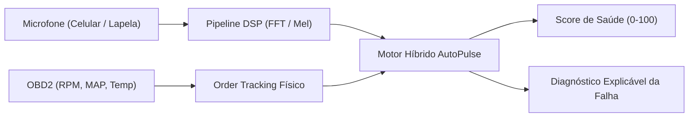

# 🎧 Projeto Noise Car — AutoPulse Acoustic Scanner
## Dossiê Arquitetural: Diagnóstico Acústico Veicular Inteligente (Shazam de Motores)
### Especializado para Renault Clio 1.0 16V D4D com Validação Técnica do GPT-Sol

---

## 1. Visão Geral & Proposta de Valor

O **Projeto Noise Car (AutoPulse Acoustic Scanner)** expande a plataforma AutoPulse para o diagnóstico acústico inteligente de anomalias mecânicas veiculares.

Enquanto aplicativos comerciais de "reconhecimento de som" tentam aplicar inteligência artificial de forma cega diretamente sobre áudios gravados pelo celular, o **AutoPulse Noise Car** introduz um salto qualitativo pioneiro: **a fusão multimodal entre acústica e a telemetria em tempo real da porta OBD2**.

---

## 2. A Física do Motor: Por que o OBD2 muda tudo? (Order Tracking)

No ciclo mecânico de 4 tempos de um motor a combustão interna (como o Renault D4D 1.0 16V), todos os eventos acústicos e vibratórios são **funções determinísticas da velocidade angular do virabrequim**:

$$\text{Frequência Fundamental do Motor: } f_0 = \frac{\text{RPM}}{60} \text{ Hz}$$

| Componente Mecânico | Ordem Harmônica | Frequência a 750 RPM (Marcha Lenta) | Frequência a 2.400 RPM (Cruzeiro) | Padrão Acústico / Falha |
| :--- | :--- | :--- | :--- | :--- |
| **Comando de Válvulas & Tuchos** | **0.5x** ($f_0 / 2$) | **6.25 Hz** | **20.0 Hz** | Batida ritmada de tuchos mecânicos com folga excessiva (*valve ticking / tapping*). |
| **Desbalanceamento de Virabrequim / Volante** | **1.0x** ($f_0$) | **12.5 Hz** | **40.0 Hz** | Vibração primária de rotação e embreagem. |
| **Combustão / Queima dos 4 Cilindros** | **2.0x** ($2 \cdot f_0$) | **25.0 Hz** | **80.0 Hz** | Frequência de disparo dos cilindros (4 cilindros $\div$ 2 voltas = 2 queimas/volta). Falha gera assimetria nesta ordem. |
| **Alternador, Bomba d'Água e Rolamentos** | **$R_{\text{polia}} \times f_0$** (aprox. 2.2x a 2.5x) | **27.5 a 31.2 Hz** | **88.0 a 100.0 Hz** | Ronco ou chiado de rolamento gasto proporcional à razão de diâmetro das polias. |
| **Correia Dentada / Poly-V (Atrito)** | **Banda Larga** | 2.5 kHz a 6.0 kHz | 3.0 kHz a 7.5 kHz | Chiado agudo contínuo (*belt squeal*) por ressecamento ou perda de tensão. |

> **Vantagem Competitiva:** Com a telemetria do OBD2, o algoritmo não precisa "adivinhar" o que é o som. Ele calcula exatamente em quais frequências a energia deve ser inspecionada para cada rotação do motor!

---

## 3. Arquitetura de Machine Learning Híbrida (Recomendação GPT-Sol)

O GPT-Sol destacou que treinar uma rede neural pura (CNN/Transformer) direto do áudio exigiria milhares de gravações de Clios com defeitos reais — algo inviável. A solução validada é uma **arquitetura em 3 camadas**:

### Camada 1: Filtro Físico de Ordens (Order Tracking DSP)
- Calcula a energia acústica concentrada nos harmônicos $\mathbf{0.5x}$, $\mathbf{1.0x}$, $\mathbf{2.0x}$ e na razão da polia do alternador.
- Isola componentes mecânicos antes mesmo de acionar qualquer modelo de IA.

### Camada 2: Detecção Não-Supervisionada de Anomalias (Autoencoder)
- Treinado exclusivamente com gravações de motores **saudáveis**.
- Entrada: Mel-Espectrograma de 1 segundo (128 bandas Mel, 16 kHz).
- Saída: Erro de reconstrução $\mathcal{L}_{\text{recon}}$.
  - Erro baixo $\rightarrow$ **Motor Saudável (Score 90–100)**.
  - Erro elevado $\rightarrow$ **Anomalia Detectada**.

### Camada 3: Classificador Convolucional Leve (MobileNetV3 / YAMNet recortado)
- Acionado apenas quando a Camada 2 acusa anomalia.
- Recebe: Mel-Espectrograma + Vetor de Energias por Ordem Harmônica + RPM + Carga do Motor.
- Classifica o defeito em categorias pré-definidas:
  1. `VALVE_TICK`: Folga de válvulas / tucho mecânico;
  2. `BELT_SQUEAL`: Chiado de correia poly-V ressecada/frouxa;
  3. `BEARING_WHINE`: Rolamento de alternador / polia tensora roncando;
  4. `EXHAUST_LEAK`: Furo ou sopro no coletor de escape;
  5. `KNOCKING`: Batida de pino / detonação sob carga;
  6. `MISFIRE`: Falha de queima com assimetria harmônica.

---

## 4. Stack Tecnológica & Execução Edge no Celular

Para garantir que a análise funcione 100% offline no smartphone Android sem depender de servidores:

1. **Captura de Áudio:**
   - Taxa de amostragem: **16.000 Hz ou 22.050 Hz Mono** (suficiente para cobrir até 8–11 kHz com baixo consumo de CPU e memória).
   - Buffer circular de 1.0 a 2.0 segundos.
2. **Transformações DSP (Tempo $\rightarrow$ Frequência):**
   - Web Audio API (`AnalyserNode` / `AudioWorklet`) para visualização de espectro a 60 FPS na tela do celular.
   - Algoritmo STFT (Short-Time Fourier Transform) com janela Hanning de 1024 pontos e hop de 512 pontos.
   - Conversão para Escala Mel (128 filtros triangulares).
3. **Runtime de Machine Learning Mobile:**
   - **TensorFlow Lite (TFLite) com NNAPI** ou **ONNX Runtime Mobile (quantizado em INT8)** embarcado no APK Capacitor.
   - Modelo compacto (< 3 MB de footprint de memória), executando inferência em menos de 25 ms.

---

## 5. Protocolo de Inspeção Prática (SNR & Captura)

Para eliminar ruídos espúrios (vento, pneus, tráfego da rua), o diagnóstico não deve ser feito com o carro rodando em alta velocidade, mas sim através de um **Protocolo Guiado de Inspeção**:

1. **Condições Iniciais (validadas pelo OBD2):**
   - Veículo parado ($\text{Velocidade} = 0 \text{ km/h}$).
   - Temperatura da água em regime normal ($\text{Coolant} \ge 80^\circ\text{C}$).
2. **Roteiro de 3 Etapas:**
   - **Etapa A (Marcha Lenta - 30s):** Carro em ~750 RPM em ponto morto com capô aberto. O microfone capta ruídos de tuchos e vazamentos de escape.
   - **Etapa B (Cruzeiro Estacionário - 30s):** Usuário mantém o acelerador fixo em 2.000 RPM. Revela folgas de biela e rolamentos sob rotação constante.
   - **Etapa C (Aceleração Rápida / Snap-Throttle - 10s):** Aceleração brusca de 1.000 para 3.500 RPM para evidenciar detonação (*knock*) e chiado dinâmico de correia.
3. **Hardware de Captura Recomendado:**
   - *Opção Básica:* Microfone do smartphone posicionado a ~50 cm do motor aberto.
   - *Opção Pro (Excelente custo-benefício):* Microfone de lapela externo P3 de baixo custo preso com presilha ou imã próximo à tampa de válvulas ou alternador.
   - *Opção de Oficina:* Sensor piezoelétrico de contato mecânico (imune a sons aéreos externos).

---

## 6. Roadmap Faseado de Implementação

| Fase | Título | Entregáveis Técnicos |
| :--- | :--- | :--- |
| **Fase 0** | **Captura & Sincronização** | Módulo de gravação de áudio sincronizado com timestamps dos PIDs OBD2 (`RPM`, `MAP`, `Temp`). Armazenamento local de amostras `.wav + .json`. |
| **Fase 1** | **Visualizador Espectrográfico (Cockpit)** | Renderização de Espectrograma Mel em tempo real e visualizador de frequências (Osciloscópio / RTA) no painel do AutoPulse. |
| **Fase 2** | **Motor de Order Tracking Físico** | Extração matemática das ordens 0.5x, 1x, 2x e polias com base no RPM do OBD2. Exibição de alertas quando uma ordem excede o baseline físico. |
| **Fase 3** | **Acoustic Health Score (Autoencoder)** | Modelo de detecção de anomalias treinado com o motor saudável. Pontuação de saúde acústica de 0 a 100. |
| **Fase 4** | **Classificador de Falhas Mecânicas** | Modelo supervisionado classificando Tucho, Correia, Rolamento, Misfire e Escape. |
| **Fase 5** | **Copilot Mecânico Explicativo** | Interface executiva gerando relatórios com diagnósticos explicáveis: *"Confiança 87%: Padrão acústico compatível com ruído de rolamento do alternador (pico na ordem 2.3x RPM). Recomenda-se checar correia e polia tensora."* |
